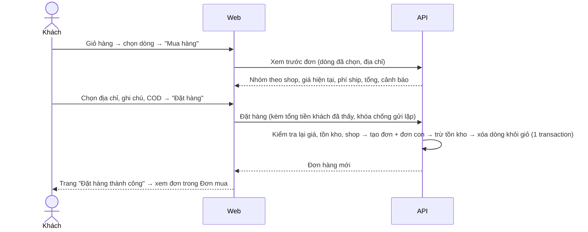

# PRD: Đặt hàng và Đơn mua (Customer Orders)

| | |
|---|---|
| **Sản phẩm** | Nomori Marketplace |
| **Module** | Customer Orders: checkout (F17-A) và đơn hàng phía khách (F18-A) |
| **Cập nhật** | 2026-10-04 |
| **Phụ thuộc** | Giỏ hàng (F16-A), Tồn kho (F12-A), Giá (F14-A), Tiền tệ (F07-A), Địa chỉ (F07-C), Email |
| **Module liên quan** | [Đơn hàng người bán](vendor-orders-prd.md) (shop xử lý đơn con), [Đối soát và hoa hồng](vendor-settlement-prd.md), Thanh toán online (F19), Vận chuyển (F20) |

---

## 1. Mục đích

- Khách đặt hàng từ giỏ hàng, kể cả khi giỏ có sản phẩm của nhiều shop.
- Khách xem lại mọi đơn đã mua trong mục **Đơn mua**, theo dõi từng phần đơn của từng shop, hủy khi còn kịp và xác nhận đã nhận hàng.
- Đơn hàng giữ đúng tên, giá, địa chỉ tại thời điểm đặt, không đổi theo sản phẩm hay sổ địa chỉ sau này.

## 2. Khái niệm

Dùng chung thuật ngữ với [Đơn hàng người bán](vendor-orders-prd.md):

| Thuật ngữ | Nghĩa |
|---|---|
| **Đơn hàng** (`Order`) | Kết quả của một lần đặt hàng. Có một địa chỉ giao, một phương thức thanh toán, một tổng tiền |
| **Đơn con** (`StoreOrder`) | Phần của đơn hàng thuộc một shop. Mỗi shop trong giỏ tạo một đơn con, có trạng thái, phí vận chuyển và mã vận đơn riêng |
| **Dòng hàng** (`OrderItem`) | Một sản phẩm, hoặc một tổ hợp biến thể, trong đơn con. Lưu tên, biến thể, ảnh, đơn giá, số lượng lúc đặt |
| **Trạng thái tổng** | Trạng thái của đơn hàng, tính từ các đơn con (mục 6.2). Không lưu riêng |

## 3. Phạm vi

### Trong phạm vi

- Trang **Thanh toán** (checkout): chọn địa chỉ giao hàng, xem lại hàng theo từng shop, ghi chú cho từng shop, chọn phương thức thanh toán, xem tổng tiền, đặt hàng.
- Đặt hàng từ toàn bộ giỏ, hoặc chỉ các dòng khách chọn trong giỏ.
- Tạo đơn hàng và tách đơn con theo shop; trừ tồn kho; xóa các dòng đã đặt khỏi giỏ.
- Thanh toán khi nhận hàng (COD).
- Mục **Đơn mua**: danh sách đơn theo tab trạng thái, tìm kiếm, chi tiết đơn.
- Khách hủy đơn con khi còn chờ xác nhận; xác nhận đã nhận hàng; mua lại.
- Email cho khách khi đặt hàng thành công và khi đơn con đổi trạng thái.

### Ngoài phạm vi

- Thanh toán online, hoàn tiền: module Thanh toán (F19). Thiết kế này chừa chỗ cho trạng thái thanh toán (D5).
- Bảng phí vận chuyển theo khu vực, kết nối đơn vị vận chuyển: module Vận chuyển (F20). Trước khi có F20, phí vận chuyển theo D6.
- Mã giảm giá, voucher: module Khuyến mãi (F15).
- Thuế: F07-E.
- Đổi trả, khiếu nại, đánh giá sản phẩm sau khi nhận.
- Đặt hàng khi chưa đăng nhập (khách vãng lai, guest checkout). Không hỗ trợ: phải đăng nhập mới đặt được hàng (FR-01).
- Phía shop xác nhận, giao hàng, hủy đơn con: [Đơn hàng người bán](vendor-orders-prd.md). Tài liệu này chỉ mô tả phần khách thấy và làm.

## 4. Vai trò

| Vai trò | Quyền trong module |
|---|---|
| **Khách hàng** (đã đăng nhập) | Đặt hàng; xem đơn của chính mình; hủy đơn con khi còn `Pending`; xác nhận đã nhận hàng; mua lại |
| **Thành viên shop** | Không dùng màn hình của module này. Khi mua hàng như một khách thì không mua được sản phẩm của shop mình (giống giỏ hàng) |
| **Admin** | Xem mọi đơn hàng. Can thiệp đơn con theo [Đơn hàng người bán](vendor-orders-prd.md), US-D1 |
| **Khách vãng lai** | Bấm thanh toán thì được chuyển sang đăng nhập, sau đó quay lại trang thanh toán |

## 5. Luồng chính

## 6. Trạng thái

### 6.1. Đơn con

Vòng đời đơn con theo [Đơn hàng người bán](vendor-orders-prd.md), mục 5. Khách thấy các trạng thái dưới tên sau:

| Trạng thái | Tên hiển thị cho khách | Khách làm được gì |
|---|---|---|
| `Pending` | Chờ xác nhận | Hủy đơn con |
| `Confirmed` | Chờ lấy hàng | Xem |
| `Shipped` | Đang giao | Xác nhận **Đã nhận hàng**; xem đơn vị vận chuyển và mã vận đơn |
| `Delivered` | Đã giao | Mua lại |
| `Completed` | Hoàn thành | Mua lại |
| `Cancelled` | Đã hủy | Xem lý do, ai hủy; mua lại |

### 6.2. Trạng thái tổng của đơn hàng

| Trạng thái tổng | Điều kiện |
|---|---|
| Đang xử lý | Còn ít nhất một đơn con chưa kết thúc (không phải `Delivered`, `Completed`, `Cancelled`) |
| Đã giao | Mọi đơn con đã `Delivered` hoặc `Completed` hoặc `Cancelled`, và ít nhất một đơn con không bị hủy |
| Đã hủy | Mọi đơn con đều `Cancelled` |

### 6.3. Tab trong Đơn mua

Mục Đơn mua hiển thị theo **đơn con**, vì mỗi shop giao riêng và trạng thái riêng. Mỗi thẻ đơn con ghi rõ mã đơn hàng chung.

| Tab | Đơn con có trạng thái |
|---|---|
| Tất cả | mọi trạng thái |
| Chờ xác nhận | `Pending` |
| Chờ lấy hàng | `Confirmed` |
| Đang giao | `Shipped` |
| Đã giao | `Delivered`, `Completed` |
| Đã hủy | `Cancelled` |

## 7. User story và tiêu chí chấp nhận

### Epic A: Thanh toán (checkout)

**US-A1.** Là khách, tôi muốn chọn những sản phẩm trong giỏ để mua.

- [ ] Mỗi dòng trong giỏ có ô chọn; có ô chọn tất cả của từng shop và của cả giỏ. Mặc định chọn hết.
- [ ] Nút **Mua hàng** hiện số dòng đã chọn và tạm tính; bị khóa khi chưa chọn dòng nào hoặc có dòng đã chọn đang lỗi (`unavailable`, `out_of_stock`, `insufficient_stock`, `variant_unavailable`).
- [ ] Dòng có cảnh báo `price_changed` vẫn chọn được; trang thanh toán dùng giá mới và báo rõ giá đã đổi.
- [ ] Khách vãng lai bấm Mua hàng thì được chuyển sang đăng nhập rồi quay lại.

**US-A2.** Là khách, tôi muốn chọn địa chỉ giao hàng.

- [ ] Mặc định chọn địa chỉ mặc định trong sổ địa chỉ. Đổi được sang địa chỉ khác trong sổ.
- [ ] Thêm được địa chỉ mới ngay trên trang thanh toán; địa chỉ mới được lưu vào sổ địa chỉ.
- [ ] Chưa có địa chỉ nào thì không đặt được hàng, và trang yêu cầu thêm địa chỉ.
- [ ] Địa chỉ phải hợp lệ theo quy tắc quốc gia, tỉnh/bang của F07-C. Quốc gia không giao được (theo F20 khi có) thì báo lỗi.

**US-A3.** Là khách, tôi muốn xem lại đơn trước khi đặt.

- [ ] Hàng được nhóm theo shop: tên shop, ảnh, tên sản phẩm, biến thể, đơn giá, số lượng, thành tiền.
- [ ] Mỗi shop có ô **Lời nhắn cho shop** (không bắt buộc, tối đa 500 ký tự) và dòng **Phí vận chuyển**.
- [ ] Phần tổng: tổng tiền hàng, tổng phí vận chuyển, **tổng thanh toán**. Tiền hiển thị theo tiền tệ khách chọn kèm ghi chú "quy đổi gần đúng"; số tiền thật là tiền tệ chính (F07-A, D2).
- [ ] Không sửa số lượng ở trang thanh toán; muốn sửa thì quay lại giỏ.

**US-A4.** Là khách, tôi muốn chọn cách thanh toán.

- [ ] Có phương thức **Thanh toán khi nhận hàng (COD)**, được chọn sẵn.
- [ ] Khi có F19, các phương thức online hiện thêm ở đây (D5).

**US-A5.** Là khách, tôi muốn đặt hàng.

- [ ] Bấm **Đặt hàng** thì máy chủ kiểm tra lại toàn bộ: sản phẩm còn bán, shop còn hoạt động, đủ tồn kho, giá hiện tại, địa chỉ hợp lệ.
- [ ] Nếu tổng tiền máy chủ tính khác tổng khách đang thấy (giá hoặc phí đổi trong lúc khách ở trang thanh toán), đơn **không** được tạo; trang tải lại số mới và yêu cầu khách bấm Đặt hàng lần nữa.
- [ ] Nếu có dòng hết hàng hoặc ngừng bán, đơn không được tạo; trang chỉ rõ dòng nào và cho quay lại giỏ.
- [ ] Bấm Đặt hàng nhiều lần (hoặc mạng chập chờn rồi gửi lại) chỉ tạo **một** đơn.
- [ ] Đặt thành công: tạo 1 đơn hàng và 1 đơn con cho mỗi shop; tồn kho bị trừ; các dòng đã đặt bị xóa khỏi giỏ, dòng không chọn vẫn còn; số trên biểu tượng giỏ hàng cập nhật.
- [ ] Chuyển sang trang **Đặt hàng thành công**: mã đơn, tổng thanh toán, số đơn con, nút **Xem đơn hàng** và **Tiếp tục mua sắm**.
- [ ] Khách nhận email xác nhận đặt hàng. Mỗi shop nhận email có đơn mới (theo Đơn hàng người bán, mục 10).

### Epic B: Đơn mua

**US-B1.** Là khách, tôi muốn xem các đơn đã mua.

- [ ] Vào từ menu tài khoản → **Đơn mua** (`/customer/orders`).
- [ ] Có các tab ở mục 6.3, mỗi tab kèm số lượng.
- [ ] Mỗi thẻ là một đơn con: tên shop (link tới trang shop), trạng thái, mã đơn, ngày đặt, các dòng hàng (ảnh, tên, biến thể, số lượng, đơn giá), tổng tiền của đơn con.
- [ ] Mới nhất lên đầu; phân trang hoặc tải thêm, 10 thẻ mỗi lần.
- [ ] Tìm theo mã đơn, tên shop hoặc tên sản phẩm.
- [ ] Chưa có đơn nào thì hiện trạng thái trống và nút **Mua sắm ngay**.

**US-B2.** Là khách, tôi muốn xem chi tiết một đơn hàng.

- [ ] Trang chi tiết (`/customer/orders/:id`) hiện: mã đơn, ngày đặt, trạng thái tổng, địa chỉ giao (bản lưu lúc đặt), phương thức và trạng thái thanh toán.
- [ ] Từng đơn con: tên shop, trạng thái, dòng hàng, lời nhắn khách đã gửi, phí vận chuyển, tổng đơn con, đơn vị vận chuyển và mã vận đơn (khi đã giao cho vận chuyển).
- [ ] Lịch sử trạng thái của từng đơn con: thời điểm, sự kiện, lý do hủy nếu có. Người thực hiện hiện dưới dạng "Bạn", "Shop", "Nomori" hoặc "Hệ thống", không hiện tên người.
- [ ] Phần tổng: tiền hàng, phí vận chuyển, tổng thanh toán.
- [ ] Bấm vào tên sản phẩm mở trang sản phẩm hiện tại; nếu sản phẩm đã ngừng bán thì vẫn hiện thông tin đã lưu trong đơn nhưng không có link.

**US-B3.** Là khách, tôi muốn hủy đơn khi đổi ý.

- [ ] Nút **Hủy đơn** ở đơn con `Pending`. Không có nút khi shop đã xác nhận.
- [ ] Bắt buộc chọn lý do: Muốn đổi địa chỉ giao, Muốn đổi sản phẩm hoặc số lượng, Đổi ý không mua nữa, Tìm được giá tốt hơn, Khác (kèm mô tả, tối đa 500 ký tự).
- [ ] Hủy xong: đơn con chuyển `Cancelled`, tồn kho được hoàn, shop nhận email.
- [ ] Đơn hàng có nhiều đơn con thì hủy từng đơn con; có nút **Hủy cả đơn** khi mọi đơn con còn `Pending`.
- [ ] Nếu shop vừa xác nhận trước khi khách bấm hủy, thao tác hủy bị từ chối và trang hiện trạng thái mới.

**US-B4.** Là khách, tôi muốn xác nhận đã nhận hàng.

- [ ] Nút **Đã nhận hàng** ở đơn con `Shipped`, có hộp xác nhận.
- [ ] Bấm xong: đơn con chuyển `Delivered`. Với COD, thanh toán của đơn con được ghi là đã thu.
- [ ] Không bấm thì đơn con tự chuyển `Delivered` sau 7 ngày (theo Đơn hàng người bán, FR-08).

**US-B5.** Là khách, tôi muốn mua lại.

- [ ] Nút **Mua lại** ở đơn con `Delivered`, `Completed`, `Cancelled`.
- [ ] Bấm thì các sản phẩm còn bán của đơn con được thêm vào giỏ với số lượng cũ (cộng dồn nếu đã có trong giỏ), rồi chuyển sang giỏ hàng. Giá theo giá hiện tại.
- [ ] Sản phẩm không còn bán hoặc không đủ hàng được báo rõ; các sản phẩm khác vẫn được thêm.

## 8. Yêu cầu chức năng

| ID | Yêu cầu | Story |
|---|---|---|
| FR-01 | Chỉ khách đã đăng nhập mới vào được trang thanh toán và đặt được hàng; chỉ đặt từ các dòng trong giỏ của chính mình. Mọi API của module (xem trước, đặt hàng, Đơn mua) trả `401` khi chưa đăng nhập; trang `/checkout` và `/customer/orders` chuyển sang trang đăng nhập rồi quay lại đúng trang | A1, A5, B1 |
| FR-02 | Giá, phí vận chuyển và tổng tiền luôn do máy chủ tính lúc đặt hàng. Tổng khác với tổng khách đã thấy thì từ chối, không tự đặt theo giá mới | A3, A5 |
| FR-03 | Một lần đặt hàng tạo 1 đơn hàng và 1 đơn con cho mỗi shop có dòng được chọn | A5 |
| FR-04 | Dòng hàng lưu tên sản phẩm, tên và giá trị biến thể, SKU, ảnh, đơn giá, số lượng lúc đặt; đơn hàng lưu bản sao địa chỉ giao (họ tên, điện thoại, địa chỉ, tỉnh/bang, quốc gia, mã bưu chính). Sửa sản phẩm hay sổ địa chỉ sau đó không làm đổi đơn | A5, B2 |
| FR-05 | Tạo đơn, tạo đơn con, trừ tồn kho và xóa dòng khỏi giỏ là một thao tác nguyên tử: hoặc xong hết, hoặc không có gì thay đổi | A5 |
| FR-06 | Không bán vượt tồn kho khi nhiều khách đặt cùng lúc; sản phẩm không theo dõi tồn kho thì không bị chặn | A5 |
| FR-07 | Không đặt được sản phẩm đã ẩn, ngừng bán, của shop đang tắt, hoặc của shop mà khách là thành viên | A5 |
| FR-08 | Gửi lại cùng một yêu cầu đặt hàng (cùng khóa chống gửi lặp) trả về đơn đã tạo, không tạo đơn mới | A5 |
| FR-09 | Đơn hàng lưu mã tiền tệ chính tại thời điểm đặt; mọi số tiền của đơn ở tiền tệ đó (F07-A, D1–D2) | A3, B2 |
| FR-10 | Mã đơn hàng dạng `NM<yyMMdd>-<số thứ tự 4 chữ số trong ngày>`, ví dụ `NM261004-0007`; mã đơn con thêm `-<số thứ tự shop>`, ví dụ `NM261004-0007-2`. Mã là duy nhất | A5, B1 |
| FR-11 | Khách chỉ thấy đơn của mình. Đơn của người khác trả `404` | B1, B2 |
| FR-12 | Khách hủy được đơn con khi `Pending`, bắt buộc có lý do; hủy thì hoàn tồn kho | B3 |
| FR-13 | Khách chuyển được đơn con `Shipped` sang `Delivered`; các chuyển đổi khác từ phía khách bị từ chối | B4 |
| FR-14 | Mọi thay đổi trạng thái đơn con được ghi lịch sử (theo Đơn hàng người bán, FR-11); khách thấy vai trò người thực hiện, không thấy tên người | B2 |
| FR-15 | Mua lại thêm vào giỏ các sản phẩm còn bán theo giá hiện tại, báo rõ sản phẩm không thêm được | B5 |
| FR-16 | Email cho khách: đặt hàng thành công; đơn con được xác nhận, giao cho vận chuyển, bị hủy | A5, B |

## 9. Yêu cầu phi chức năng

| ID | Yêu cầu |
|---|---|
| NFR-01 | Tiền lưu dạng số thập phân theo số chữ số thập phân của tiền tệ chính; không dùng số thực dấu phẩy động |
| NFR-02 | Hai thao tác cùng lúc trên một đơn con (khách hủy, shop xác nhận) thì chỉ một thao tác thành công; thao tác còn lại nhận `409` và trang tải lại trạng thái mới |
| NFR-03 | Đặt hàng hoàn tất dưới 2 giây với giỏ tới 50 dòng, 10 shop |
| NFR-04 | Lời nhắn cho shop và lý do hủy được mã hóa khi hiển thị, không chạy được HTML hay script |
| NFR-05 | Không lưu và không ghi log số thẻ hay dữ liệu thanh toán nhạy cảm (khi có F19) |
| NFR-06 | API theo chuẩn `/api/v1`, lỗi dạng ProblemDetails, request ghi dữ liệu có CSRF. Dùng chung route với shop và admin, quyền xét theo người gọi (giống module Vendors) |
| NFR-07 | Audit log cho đặt hàng, hủy, xác nhận nhận hàng: chỉ ghi mã đơn, trạng thái, người thực hiện; không ghi địa chỉ hay số điện thoại |

## 10. Màn hình

| Màn hình | Đường dẫn | Nội dung chính |
|---|---|---|
| Giỏ hàng (sửa) | `/storefront/cart` | Thêm ô chọn dòng, chọn tất cả theo shop, nút **Mua hàng** |
| Thanh toán | `/checkout` | Địa chỉ giao, hàng theo shop kèm lời nhắn và phí ship, phương thức thanh toán, tổng, nút **Đặt hàng** |
| Đặt hàng thành công | `/checkout/success/:orderId` | Mã đơn, tổng, nút xem đơn |
| Đơn mua | `/customer/orders` | Tab trạng thái, tìm kiếm, thẻ đơn con, nút Hủy / Đã nhận hàng / Mua lại |
| Chi tiết đơn hàng | `/customer/orders/:id` | Địa chỉ, thanh toán, từng đơn con, lịch sử trạng thái |
| Menu tài khoản (sửa) | header | Mục **Đơn mua** bỏ nhãn "Sắp có", trỏ tới `/customer/orders` |

## 11. API

Dùng chung với [Đơn hàng người bán](vendor-orders-prd.md): một bộ route cho khách, shop và admin, quyền xét theo người gọi.

| # | Method | Route | Ai gọi | Mục đích |
|---|---|---|---|---|
| 1 | `POST` | `/api/v1/checkout/preview` | Khách | Tính trước đơn từ các dòng giỏ đã chọn và địa chỉ: nhóm theo shop, giá hiện tại, phí ship, tổng, lỗi từng dòng. Không ghi dữ liệu |
| 2 | `POST` | `/api/v1/orders` | Khách | Đặt hàng. Body: `cartItemIds`, `addressId`, `paymentMethod`, `notes` theo shop, `expectedTotal`. Header `Idempotency-Key` |
| 3 | `GET` | `/api/v1/orders` | Khách: đơn của mình. Admin: mọi đơn | Danh sách đơn con, lọc `status`, `search`, phân trang; kèm số lượng theo tab |
| 4 | `GET` | `/api/v1/orders/{id}` | Chủ đơn, admin | Chi tiết đơn hàng gồm các đơn con và lịch sử |
| 5 | `PUT` | `/api/v1/store-orders/{id}/status` | Khách, thành viên shop, admin | Đổi trạng thái đơn con. Body: `status`, `reason`, `carrier`, `trackingNumber`. Mỗi vai trò chỉ được các chuyển đổi của mình (FR-12, FR-13; shop và admin theo Đơn hàng người bán) |
| 6 | `POST` | `/api/v1/store-orders/{id}/reorder` | Chủ đơn | Thêm lại sản phẩm vào giỏ; trả danh sách dòng đã thêm và không thêm được |

Mã lỗi nghiệp vụ (`409`, trong `ProblemDetails.detail`):

| Mã | Khi nào |
|---|---|
| `order.total_changed` | Tổng máy chủ tính khác `expectedTotal`; response kèm bản xem trước mới |
| `order.items_unavailable` | Có dòng ngừng bán, hết hàng hoặc thuộc shop đang tắt; response kèm danh sách dòng lỗi |
| `order.cart_item_not_found` | Dòng giỏ không còn (đã đặt ở tab khác, đã xóa) |
| `order.address_invalid` | Địa chỉ không thuộc khách hoặc không hợp lệ |
| `store_order.invalid_transition` | Chuyển trạng thái không hợp lệ hoặc không thuộc quyền người gọi |
| `store_order.concurrent_update` | Trạng thái vừa bị người khác đổi |

## 12. Dữ liệu (định hướng)

Theo `ORDER` → `STORE_ORDER` → `ORDER_ITEM` trong `database-v2.md`, thêm các trường để lưu bản sao:

| Bảng | Trường chính |
|---|---|
| `Order` | `Id`, `OrderNumber`, `CustomerId`, `CurrencyCode`, `ItemsTotal`, `ShippingTotal`, `Total`, `PaymentMethod`, `PaymentStatus`, bản sao địa chỉ giao (họ tên, điện thoại, địa chỉ 1–2, thành phố, tỉnh/bang, mã quốc gia, mã bưu chính), `IdempotencyKey` (duy nhất theo khách), `CreatedOnUtc` |
| `StoreOrder` | `Id`, `OrderId`, `VendorId`, `SubOrderNumber`, `Status`, `ItemsTotal`, `ShippingFee`, `Total`, `CustomerNote`, `Carrier`, `TrackingNumber`, `ConfirmByUtc`, các mốc thời gian theo trạng thái, `RowVersion` (chống ghi đè đồng thời) |
| `OrderItem` | `Id`, `StoreOrderId`, `ProductId`, `CombinationId`, `ProductName`, `VariantDescription`, `Sku`, `PictureId`, `UnitPrice`, `Quantity`, `LineTotal` |
| `StoreOrderEvent` | `Id`, `StoreOrderId`, `FromStatus`, `ToStatus`, `ActorType` (Customer, Vendor, Admin, System), `ActorCustomerId`, `Reason`, `CreatedOnUtc` |

Tồn kho dùng sổ cái của F12-A: đặt hàng ghi xuất kho có tham chiếu mã đơn con; hủy ghi nhập lại cùng tham chiếu.

## 13. Email

| Sự kiện | Người nhận | Nội dung chính |
|---|---|---|
| Đặt hàng thành công | Khách | Mã đơn, các đơn con theo shop, tổng thanh toán, địa chỉ giao, link Đơn mua |
| Đơn con được xác nhận | Khách | Tên shop, mã đơn con |
| Đơn con được giao cho vận chuyển | Khách | Đơn vị vận chuyển, mã vận đơn |
| Đơn con bị hủy | Khách | Lý do, ai hủy |
| Khách hủy đơn con | Mọi thành viên shop | Mã đơn con, lý do |

## 14. Thứ tự làm đề xuất

1. **F18-A (backend)**: bảng đơn, tạo đơn nguyên tử, chống gửi lặp, mã đơn, đọc đơn của khách, hủy và nhận hàng phía khách.
2. **F17-A (backend + web)**: xem trước, đặt hàng, chọn dòng trong giỏ, trang thanh toán, trang thành công.
3. **Đơn mua (web)**: danh sách, chi tiết, hủy, nhận hàng, mua lại; bật mục Đơn mua trong menu tài khoản.
4. **Phía shop** theo [Đơn hàng người bán](vendor-orders-prd.md): xác nhận, giao hàng, hủy. Cần làm ngay sau bước 3, nếu không đơn sẽ dừng mãi ở Chờ xác nhận.
5. **Tác vụ tự động**: tự hủy, tự chuyển Đã giao, tự Hoàn thành. Chạy trong hosted service của API cho tới khi có F29 (D9).

## 15. Quyết định

| # | Quyết định |
|---|---|
| D1 | Đơn được tách thành đơn con theo shop (Đơn hàng người bán, D1) |
| D2 | Mục Đơn mua hiển thị theo đơn con; chi tiết hiển thị theo đơn hàng |
| D3 | Tiền của đơn ở tiền tệ chính của sàn, lưu kèm mã tiền tệ (F07-A, D1). Các PRD người bán dùng cùng quy tắc |
| D4 | Giá luôn tính lại ở máy chủ lúc đặt; tổng thay đổi thì yêu cầu khách đặt lại, không tự đặt theo giá mới |
| D5 | Bản đầu chỉ có thanh toán khi nhận hàng (COD). Đơn hàng có trạng thái thanh toán (`Pending`, `Paid`, `Refunded`) để F19 thêm cổng thanh toán; khi đó đơn con chỉ sang `Pending` của shop sau khi thanh toán thành công |
| D6 | Trước khi có F20, phí vận chuyển là một mức cố định cho mỗi đơn con do admin cấu hình (mặc định 0), miễn phí khi tổng tiền hàng của đơn con đạt một ngưỡng cấu hình được |
| D7 | Khách đặt được một phần giỏ; dòng không chọn ở lại giỏ |
| D8 | Mỗi lần đặt tối đa 50 dòng và 10 shop; mỗi dòng tối đa 999 sản phẩm |
| D9 | Trước khi có F29, tác vụ tự động chạy trong một hosted service của API, mỗi 5 phút, an toàn khi chạy lại (Đơn hàng người bán, NFR-04); chuyển sang F29 khi có |
| D10 | Khách không hủy được đơn con sau khi shop đã xác nhận (Đơn hàng người bán, FR-07) |
| D11 | Bản COD không giữ chỗ tồn kho trong lúc khách ở trang thanh toán: kiểm tra và trừ tồn kho ngay lúc đặt. Giữ chỗ (F12-A) dùng khi có thanh toán online, trong thời gian khách thanh toán |
