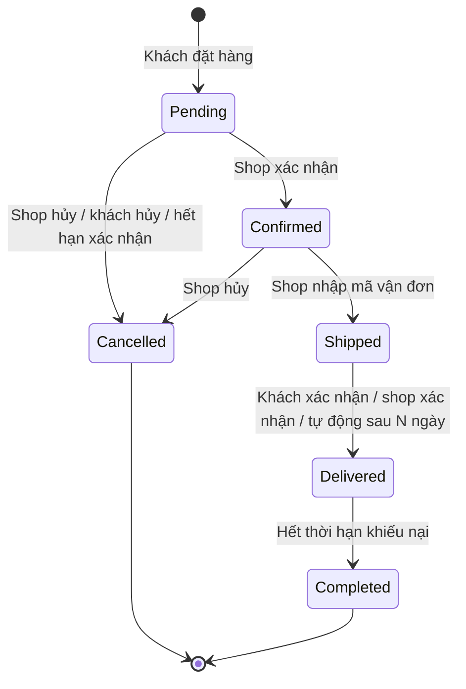

# PRD: Xử lý đơn hàng của người bán (Vendor Orders)

| | |
|---|---|
| **Sản phẩm** | Nomori Marketplace |
| **Module** | Vendor Orders |
| **Cập nhật** | 2026-09-26 |
| **Phụ thuộc** | [Sản phẩm vendor](vendor-products-prd.md); module Giỏ hàng, Checkout và Thanh toán phía khách (tạo ra đơn hàng) |
| **Module liên quan** | [Đối soát và hoa hồng](vendor-settlement-prd.md) |

---

## 1. Mục đích

- Một đơn hàng của khách có thể gồm sản phẩm của nhiều shop. Đơn được tách thành **đơn con**, mỗi shop một đơn con.
- Mỗi shop chỉ thấy và xử lý đơn con của mình: xác nhận, giao hàng, hủy.
- Khách theo dõi trạng thái từng đơn con.
- Đơn con hoàn tất là căn cứ để tính hoa hồng và đối soát.

## 2. Khái niệm

| Thuật ngữ | Nghĩa |
|---|---|
| **Đơn hàng** (`Order`) | Đơn khách đặt trong một lần checkout, có một lần thanh toán |
| **Đơn con** (`StoreOrder`) | Phần của đơn hàng thuộc một shop. Shop xử lý và giao hàng theo đơn con |
| **Dòng hàng** (`OrderItem`) | Một sản phẩm (hoặc tổ hợp thuộc tính) trong đơn con, lưu tên, giá, số lượng tại thời điểm đặt |
| **Vận đơn** (`Shipment`) | Thông tin giao hàng của đơn con: đơn vị vận chuyển, mã vận đơn |

## 3. Phạm vi

### Trong phạm vi

- Tách đơn hàng thành đơn con theo shop khi khách đặt hàng.
- Thành viên shop xem danh sách, chi tiết đơn con, và xử lý theo vòng đời trạng thái.
- Nhập đơn vị vận chuyển và mã vận đơn.
- Hủy đơn con, kèm lý do; hoàn tồn kho khi hủy.
- Tự động hủy đơn không được xác nhận, tự động hoàn tất đơn đã giao.
- Khách xem trạng thái từng đơn con và xác nhận đã nhận hàng.
- Admin xem mọi đơn và can thiệp khi cần.
- Email thông báo cho shop và khách.

### Ngoài phạm vi

- Giỏ hàng, checkout, cổng thanh toán. Thuộc module phía khách.
- Kết nối API với đơn vị vận chuyển (tính phí ship, tạo vận đơn tự động).
- Đổi trả, hoàn tiền và khiếu nại sau khi giao. Thuộc module Khiếu nại.
- In hóa đơn, phiếu giao hàng.
- Chat giữa khách và shop.

## 4. Vai trò

| Vai trò | Quyền trong module |
|---|---|
| **Thành viên shop** | Xem và xử lý đơn con của shop mình |
| **Khách hàng** | Xem đơn của mình, hủy đơn con khi còn chờ xác nhận, xác nhận đã nhận hàng |
| **Admin** | Xem mọi đơn, hủy đơn con khi cần, xử lý đơn bị treo |

## 5. Vòng đời đơn con

| Trạng thái | Nghĩa | Ai chuyển sang |
|---|---|---|
| `Pending` | Chờ shop xác nhận | Hệ thống, khi đơn được đặt (và đã thanh toán, nếu thanh toán online) |
| `Confirmed` | Shop đã nhận đơn, đang chuẩn bị hàng | Thành viên shop |
| `Shipped` | Đã giao cho đơn vị vận chuyển | Thành viên shop |
| `Delivered` | Khách đã nhận hàng | Khách, thành viên shop, hoặc hệ thống |
| `Completed` | Hết thời hạn khiếu nại; đủ điều kiện đối soát | Hệ thống |
| `Cancelled` | Đã hủy | Thành viên shop, khách, admin, hoặc hệ thống |

Trạng thái tổng của đơn hàng được tính từ các đơn con: ví dụ "Đang xử lý" khi còn đơn con chưa kết thúc, "Hoàn tất" khi mọi đơn con đã `Completed` hoặc `Cancelled`.

## 6. User story và tiêu chí chấp nhận

### Epic A: Tách đơn

**US-A1.** Là khách, khi tôi đặt hàng từ nhiều shop, tôi muốn đơn được xử lý riêng theo từng shop.

- [ ] Một lần checkout tạo 1 đơn hàng và N đơn con (N = số shop có sản phẩm trong giỏ).
- [ ] Mỗi đơn con có mã riêng, dạng `<mã đơn>-<số thứ tự>`, ví dụ `NM260926-0001-2`.
- [ ] Mỗi dòng hàng lưu tên sản phẩm, tên biến thể, giá, số lượng tại thời điểm đặt.
- [ ] Tồn kho bị trừ ngay khi đơn được tạo.
- [ ] Phí vận chuyển được tính theo từng đơn con (Q3).

### Epic B: Shop xử lý đơn

**US-B1.** Là thành viên shop, tôi muốn xem đơn cần xử lý.

- [ ] Trang "Đơn hàng" có tab theo trạng thái, kèm số lượng: Chờ xác nhận, Chờ giao, Đang giao, Đã giao, Hoàn tất, Đã hủy.
- [ ] Tìm theo mã đơn con, tên hoặc số điện thoại người nhận; lọc theo khoảng ngày đặt.
- [ ] Mỗi dòng hiện mã đơn con, ngày đặt, số sản phẩm, tổng tiền, phương thức thanh toán, trạng thái, hạn xử lý.

**US-B2.** Là thành viên shop, tôi muốn xem chi tiết đơn con.

- [ ] Hiện dòng hàng (ảnh, tên, biến thể, giá, số lượng), tổng tiền hàng, phí vận chuyển, tổng cộng.
- [ ] Hiện tên, số điện thoại, địa chỉ người nhận, ghi chú của khách.
- [ ] Hiện phương thức và trạng thái thanh toán.
- [ ] Hiện lịch sử trạng thái: thời điểm, người thực hiện, lý do nếu có.
- [ ] **Không** hiện email của khách và thông tin đơn con của shop khác.

**US-B3.** Là thành viên shop, tôi muốn xác nhận đơn.

- [ ] Nút **Xác nhận** ở đơn `Pending`. Xác nhận chọn được nhiều đơn cùng lúc.
- [ ] Đơn `Pending` quá 48 giờ (cấu hình được) mà chưa xác nhận thì tự động hủy, lý do "Shop không xác nhận kịp" (Q2).

**US-B4.** Là thành viên shop, tôi muốn cập nhật giao hàng.

- [ ] Ở đơn `Confirmed`, nhập đơn vị vận chuyển\* (chọn từ danh sách, có "Khác") và mã vận đơn\*, rồi bấm **Đã giao cho vận chuyển**. Đơn chuyển sang `Shipped`.
- [ ] Sửa được mã vận đơn khi đơn còn `Shipped`.
- [ ] Bấm **Đã giao thành công** để chuyển sang `Delivered` khi có xác nhận từ đơn vị vận chuyển.

**US-B5.** Là thành viên shop, tôi muốn hủy đơn khi không bán được.

- [ ] Hủy được khi đơn còn `Pending` hoặc `Confirmed`. Không hủy được khi đã `Shipped`.
- [ ] Bắt buộc chọn lý do: Hết hàng, Không liên lạc được khách, Sai giá, Khác (kèm mô tả).
- [ ] Hủy xong thì hoàn tồn kho. Nếu khách đã thanh toán online thì tạo yêu cầu hoàn tiền cho phần đơn con này.
- [ ] Tỷ lệ đơn bị shop hủy được thống kê để admin theo dõi.

### Epic C: Khách theo dõi đơn

**US-C1.** Là khách, tôi muốn theo dõi đơn hàng.

- [ ] Trang "Đơn hàng của tôi" hiện từng đơn hàng, bên trong là các đơn con theo shop, mỗi đơn con có trạng thái và mã vận đơn riêng.
- [ ] Nhận email khi đơn con được xác nhận, được giao cho vận chuyển, bị hủy.

**US-C2.** Là khách, tôi muốn hủy đơn khi đổi ý.

- [ ] Hủy được đơn con còn `Pending`. Không hủy được sau khi shop đã xác nhận.
- [ ] Bắt buộc chọn lý do. Tồn kho được hoàn và tiền được hoàn nếu đã thanh toán online.

**US-C3.** Là khách, tôi muốn xác nhận đã nhận hàng.

- [ ] Nút **Đã nhận hàng** ở đơn con `Shipped`. Đơn chuyển sang `Delivered`.
- [ ] Nếu khách không bấm, đơn `Shipped` tự chuyển sang `Delivered` sau 7 ngày (cấu hình được).
- [ ] Đơn `Delivered` tự chuyển sang `Completed` sau 7 ngày nếu không có khiếu nại (cấu hình được, Q4).

### Epic D: Admin

**US-D1.** Là admin, tôi muốn xem và can thiệp đơn hàng.

- [ ] Xem mọi đơn hàng và đơn con, lọc theo shop, trạng thái, khoảng ngày.
- [ ] Hủy được đơn con ở bất kỳ trạng thái nào trước `Completed`, bắt buộc có lý do.
- [ ] Mọi can thiệp của admin hiện trong lịch sử trạng thái của đơn con.

## 7. Yêu cầu chức năng

| ID | Yêu cầu | Story |
|---|---|---|
| FR-01 | Mỗi lần checkout tạo 1 đơn hàng và 1 đơn con cho mỗi shop có sản phẩm trong giỏ | A1 |
| FR-02 | Dòng hàng lưu tên, biến thể, giá tại thời điểm đặt; không bị ảnh hưởng khi sản phẩm thay đổi | A1 |
| FR-03 | Tồn kho bị trừ khi tạo đơn và được hoàn khi đơn con bị hủy | A1, B5, C2 |
| FR-04 | Đơn con chỉ chuyển trạng thái theo đúng vòng đời ở mục 5; mọi chuyển đổi khác bị từ chối | B, C, D |
| FR-05 | Thành viên shop chỉ thấy và xử lý đơn con của shop mình | B |
| FR-06 | Chuyển sang `Shipped` bắt buộc có đơn vị vận chuyển và mã vận đơn | B4 |
| FR-07 | Shop hủy được khi `Pending` hoặc `Confirmed`; khách hủy được khi `Pending`; admin hủy được trước `Completed`. Hủy luôn bắt buộc có lý do | B5, C2, D1 |
| FR-08 | Đơn con `Pending` quá 48 giờ tự hủy; `Shipped` quá 7 ngày tự chuyển `Delivered`; `Delivered` quá 7 ngày tự chuyển `Completed`. Các mốc thời gian cấu hình được | B3, C3 |
| FR-09 | Hủy đơn con đã thanh toán online thì tạo yêu cầu hoàn tiền đúng bằng giá trị đơn con đó | B5, C2 |
| FR-10 | Đơn con `Completed` được chuyển sang module Đối soát để tính hoa hồng | C3 |
| FR-11 | Mọi thay đổi trạng thái được ghi lịch sử: thời điểm, người thực hiện (hoặc "Hệ thống"), lý do | B–D |
| FR-12 | Email được gửi cho shop khi có đơn mới hoặc khách hủy; cho khách khi đơn được xác nhận, giao cho vận chuyển, bị hủy | B, C |
| FR-13 | Shop bị khóa hoặc tạm nghỉ vẫn xử lý được đơn đã đặt | B |

## 8. Yêu cầu phi chức năng

| ID | Yêu cầu |
|---|---|
| NFR-01 | Đơn con của shop khác trả `404`. Thành viên shop không thấy email khách và dữ liệu đơn con của shop khác |
| NFR-02 | Tạo đơn, trừ tồn kho và tách đơn con chạy trong một transaction; không bán vượt tồn kho khi nhiều khách đặt cùng lúc |
| NFR-03 | Hai người cùng thao tác một đơn con thì chỉ một thao tác thành công; thao tác còn lại nhận lỗi và phải tải lại |
| NFR-04 | Các tác vụ tự động (tự hủy, tự chuyển trạng thái) chạy định kỳ, chạy lại không gây sai lệch |
| NFR-05 | Tiền được lưu dạng số thập phân, đơn vị VND, không dùng số thực dấu phẩy động |
| NFR-06 | API theo chuẩn `/api/v1`, lỗi dạng ProblemDetails, request ghi dữ liệu có CSRF. Dùng chung route cho shop, khách và admin, giống module Vendors |

## 9. Màn hình

| Màn hình | Đường dẫn | Ai dùng |
|---|---|---|
| Danh sách đơn của shop | `/vendor/orders` | Thành viên shop |
| Chi tiết đơn con | `/vendor/orders/:id` | Thành viên shop |
| Đơn hàng của tôi | `/customer/orders` | Khách hàng |
| Chi tiết đơn hàng, gồm các đơn con | `/customer/orders/:id` | Khách hàng |
| Quản lý đơn hàng | `/admin/orders` | Admin |

## 10. Email

| Sự kiện | Người nhận | Nội dung chính |
|---|---|---|
| Có đơn con mới | Mọi thành viên shop | Mã đơn con, tổng tiền, hạn xác nhận |
| Khách hủy đơn con | Mọi thành viên shop | Mã đơn con, lý do |
| Đơn con sắp hết hạn xác nhận (còn 6 giờ) | Mọi thành viên shop | Mã đơn con |
| Shop xác nhận đơn con | Khách | Tên shop, mã đơn con |
| Đơn con được giao cho vận chuyển | Khách | Đơn vị vận chuyển, mã vận đơn |
| Đơn con bị hủy | Khách | Lý do, thông tin hoàn tiền nếu có |

## 11. Quyết định

### Đã chốt

| # | Quyết định |
|---|---|
| D1 | Đơn hàng được tách thành đơn con theo shop (theo `ORDER` → `STORE_ORDER` trong database-v2) |
| D2 | Sàn thu tiền của khách; shop nhận tiền qua đối soát (theo `PAYMENT` gắn với `ORDER`) |
| D3 | Mọi thành viên shop ngang quyền xử lý đơn |

### Chờ chốt

| # | Câu hỏi | Đề xuất |
|---|---|---|
| Q1 | Hỗ trợ những phương thức thanh toán nào? | COD và một cổng thanh toán online; quyết định ở module Checkout |
| Q2 | Hạn xác nhận đơn là bao lâu? | 48 giờ |
| Q3 | Phí vận chuyển do ai quy định? | Sàn quy định bảng phí cố định theo khu vực, tính riêng cho từng đơn con |
| Q4 | Thời hạn khiếu nại sau khi giao là bao lâu? | 7 ngày |
| Q5 | Đơn đã giao cho vận chuyển nhưng giao thất bại (khách từ chối nhận, sai địa chỉ) xử lý thế nào? | Thêm một ngoại lệ cho FR-07: shop chuyển `Shipped` → `Cancelled` với lý do "Giao hàng thất bại"; hàng hoàn về shop và được cộng lại tồn kho khi shop xác nhận đã nhận hàng hoàn |
