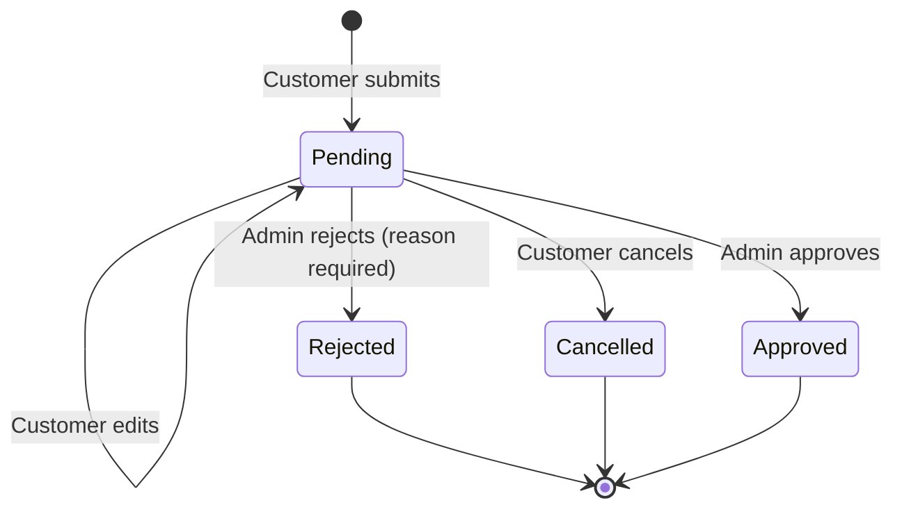
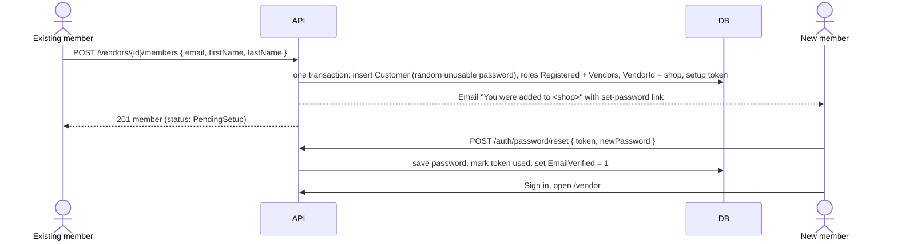

# Vendors Module

> Vietnamese version: [vendors.vi.md](vendors.vi.md). Update both files together.
> Requirements: [vendors-prd.md](vendors-prd.md). Full API contract: [vendors-api.md](vendors-api.md).

## Status

**Vendor management is implemented. Vendor self-registration and vendor member accounts are designed but not implemented.**

| Slice | Backend | Angular | Notes |
|---|---|---|---|
| Vendor entity, admin CRUD, notes | Done | Done (`/admin/vendors`) | Migration `202609250002`. Admin **create** is removed by this module (decision D) |
| Link existing customer account to vendor (admin) | Done | Done | **Removed** by this module (decision 9) |
| Public vendor list/detail | Done | Done (`/storefront/vendors`) | Only active, non-deleted vendors |
| Vendor portal: own vendor info | Done (`GET /vendor/portal`) | Not started | `vendor.portal` is not mapped to any role yet |
| **Vendor application (self-registration)** | Designed | Designed | Part 2 |
| **Vendor members (shop accounts)** | Designed | Designed | Part 3 |

Deferred beyond this module: vendor product management, vendor orders/payouts, vendor pictures and addresses, document uploads, commission settings, different permissions per member.

## Scope

Included:

- **Vendors are created only by approving a vendor application.** Admins cannot create vendors directly.
- Admin updates, soft-deletes and lists vendors; adds internal notes; views and removes members.
- Storefront lists active vendors and shows vendor details.
- A signed-in vendor account reads its own vendor record.
- A verified customer applies to become a vendor; an administrator approves or rejects the application. Approval creates the vendor, links the account and grants the `Vendors` role in one transaction.
- **A vendor can have many accounts ("members"). All members have the same permissions. Any member can create a new account for the shop and remove other members.**
- **An account belongs to at most one vendor.**

Deferred:

- Owner, manager or staff roles inside a vendor. All members are equal.
- One account belonging to several vendors.
- Linking or inviting an existing customer account into a shop. Not planned: shop accounts are always created new (decision 9).
- Uploading identity or business documents (no file storage exists yet).
- Vendor editing its own profile from the portal.
- Email notification to administrators for new applications.

## Source map from nopCommerce

- `Nop.Core.Domain.Vendors.Vendor` and `VendorNote` for the entity shape (`PictureId`, `AddressId`, `AdminComment`, `Deleted`, `DisplayOrder`).
- `Customer.VendorId` for the account-to-vendor link. As in nopCommerce, several customers may point to the same vendor and all of them get the same vendor access.
- `VendorController.ApplyVendor` (nopCommerce "Apply for vendor account") for the self-registration idea. nopCommerce creates an inactive vendor immediately; Nomori instead stores a separate `VendorApplication` so that rejected and cancelled requests never create vendor rows and the review history is kept.
- nopCommerce has no vendor-side member management; Part 3 is Nomori-specific.

## Core invariant

**An account has the `Vendors` role if and only if `Customer.VendorId` is set.**

Every operation that links or unlinks an account updates `Customer.VendorId` and the `Vendors` role mapping in the same transaction:

| Operation | `Customer.VendorId` | `Vendors` role |
|---|---|---|
| Application approved | set | added |
| Member creates an account | set | added |
| Member or admin removes a member | cleared | removed |
| Vendor soft-deleted | cleared for all members | removed from all members |

Roles are additive. A vendor member keeps `Registered` and can still shop as a customer.

---

## Part 1: Vendor management (implemented)

### Data model

Migration `202609250002 VendorMigration`:

- `Vendor`: `Id`, `Name` (400), `Email` (320), `Description`, `PictureId`, `AddressId`, `AdminComment`, `Active`, `Deleted`, `DisplayOrder`, `CreatedOnUtc`, `UpdatedOnUtc`. Index `IX_Vendor_Active_Deleted`.
- `VendorNote`: `Id`, `VendorId` (FK, cascade delete), `Note`, `CreatedOnUtc`.
- `Customer.VendorId`: nullable FK to `Vendor`, `ON DELETE SET NULL`, non-unique index `IX_Customer_VendorId`. Several accounts can point to one vendor; one account points to at most one vendor.
- `Product.VendorId`: changed from `0` placeholder to nullable FK to `Vendor`.
- Permissions `vendor.manage` (granted to `Administrator`) and `vendor.portal` (granted to no role).

### Business rules

- Name is required, at most 400 characters. Email is required, at most 320 characters, stored trimmed and lower-case.
- Delete is a soft delete (`Deleted = 1`). Deleted vendors are hidden from every query.
- The storefront returns only vendors with `Active = 1`.

### API

Public (anonymous):

```text
GET /api/v1/vendors?page=&pageSize=&search=
GET /api/v1/vendors/{id}
```

Vendor portal (`vendor.portal`):

```text
GET /api/v1/vendor/portal
```

Admin (`vendor.manage`):

```text
GET    /api/v1/admin/vendors?page=&pageSize=&search=&active=
GET    /api/v1/admin/vendors/{id}
POST   /api/v1/admin/vendors                         removed by this module (decision D)
PUT    /api/v1/admin/vendors/{id}
DELETE /api/v1/admin/vendors/{id}
POST   /api/v1/admin/vendors/{id}/customer          { "customerId": 12 }   removed by this module
DELETE /api/v1/admin/vendors/{id}/customer/{customerId}      removed by this module
GET    /api/v1/admin/vendors/{id}/notes
POST   /api/v1/admin/vendors/{id}/notes              { "note": "..." }
DELETE /api/v1/admin/vendors/{id}/notes/{noteId}
```

After this module, the public, portal and admin routes above are merged into one set of routes under `/api/v1/vendors`. See [vendors-api.md](vendors-api.md), section 2, for the mapping from old to new routes.

### Code map

```text
src/Nomori.Marketplace.Core/Vendors/Vendor.cs                 entity, commands, IVendorStore, IVendorService
src/Nomori.Marketplace.Data/Vendors/SqlVendorStore.cs         ADO.NET store
src/Nomori.Marketplace.Services/Vendors/VendorService.cs      validation and orchestration
src/Nomori.Marketplace.Api/Modules/Vendors/VendorController.cs  public, portal and admin controllers + DTOs

frontend: src/app/core/vendors/*, src/app/admin/pages/admin-vendors.page.ts,
          src/app/storefront/pages/vendor-list.page.ts, vendor-detail.page.ts
```

### Known gaps

All of these gaps break the core invariant. This module fixes all of them.

1. `vendor.portal` is not mapped to any role, so no account can open the portal. **Fix:** seed role `Vendors` with `vendor.portal`.
2. `AssignCustomerAsync` sets `Customer.VendorId` but does not grant any role. It also silently moves an account that already belongs to another vendor. **Fix:** remove the endpoint, `AssignCustomerAsync` and the Angular link UI. Linking existing accounts is no longer a feature (decision 9).
3. `DELETE /admin/vendors/{id}/customer/{customerId}` ignores `{id}` and unlinks the customer from whichever vendor it belongs to. It also leaves the role in place. **Fix:** replace it with `DELETE /vendors/{id}/members/{customerId}` (Part 3), which checks `{id}` and removes `Vendors`.
4. Soft-deleting a vendor keeps `Customer.VendorId` pointing to it. **Fix:** in the same transaction, clear `VendorId` and remove `Vendors` for all members.

---

## Part 2: Vendor application (designed)

### Workflow



A new application may be submitted after `Rejected` or `Cancelled`. `Approved`, `Rejected` and `Cancelled` rows are never modified again; they are the review history.

On **approve**, in one database transaction:

1. Insert a `Vendor` from the application (`Active = 1`).
2. Set `Customer.VendorId` to the new vendor.
3. Add the `Vendors` role to the customer if it is missing (add, not replace).
4. Set the application to `Approved` with `VendorId`, `ReviewedByCustomerId` and `ReviewedOnUtc`.

After commit, the service sends the approval email and writes the audit event. An email failure is logged and does not undo the approval.

The approved applicant becomes the first member of the shop. Further accounts are added as described in Part 3; they do not submit applications.

Permissions are loaded from the database on every request (`PermissionService`). The applicant therefore gets `vendor.portal` right away and does not need to sign in again. The Angular app only reloads its permission list.

### Business rules

Submission:

- The caller must be authenticated and have `EmailVerified = true`.
- The caller must not already be linked to a vendor (`Customer.VendorId IS NULL`).
- The caller may have at most one `Pending` application. A filtered unique index enforces this, so two submissions sent at the same moment cannot both succeed.
- `ShopName` is required, at most 400 characters, and must not match (case-insensitive) a non-deleted vendor or another `Pending` application.
- `Email` is required, at most 320 characters, and is stored trimmed and lower-case. `PhoneNumber` is required, at most 50 characters, and uses the same character rules as the customer profile phone.
- `Description` is optional. `TaxCode` is optional, at most 50 characters. `BusinessAddress` is optional, at most 1000 characters.

Review:

- Only `Pending` applications can be edited, cancelled, approved or rejected. Any other status returns `409`.
- Approval fails with `409` if the applicant has been linked to a vendor since submitting.
- The admin may override `ShopName` and add an `AdminComment` when approving.
- Rejection requires `Reason`, at most 2000 characters. The reason is shown to the applicant and included in the email.

### Data model

Migration `202609260001 VendorApplicationMigration`:

| Column | Type | Notes |
|---|---|---|
| `Id` | `int` identity PK | |
| `CustomerId` | `int` FK → `Customer` | applicant |
| `ShopName` | `nvarchar(400)` | same length as `Vendor.Name` |
| `Email` | `nvarchar(320)` | shop contact email |
| `PhoneNumber` | `nvarchar(50)` | |
| `Description` | `nvarchar(max)` null | |
| `TaxCode` | `nvarchar(50)` null | |
| `BusinessAddress` | `nvarchar(1000)` null | |
| `Status` | `int` | `0` Pending, `1` Approved, `2` Rejected, `3` Cancelled |
| `RejectReason` | `nvarchar(2000)` null | |
| `ReviewedByCustomerId` | `int` null FK → `Customer` | reviewing admin |
| `ReviewedOnUtc` | `datetime2` null | |
| `VendorId` | `int` null FK → `Vendor` | set on approval |
| `CreatedOnUtc`, `UpdatedOnUtc` | `datetime2` | |

Indexes:

- `UX_VendorApplication_Customer_Pending`: unique on `CustomerId` `WHERE Status = 0`.
- `IX_VendorApplication_Status_CreatedOnUtc`: supports the admin review list.

Seed data (idempotent `IF NOT EXISTS`, as in `VendorMigration`):

- Role `Vendors` (`IsSystemRole = 1`, `Active = 1`).
- Map `vendor.portal` to `Vendors`.
- Backfill for the core invariant: clear `VendorId` for customers whose vendor is deleted, then grant `Vendors` to every customer whose `VendorId` is not null.

`Down()` removes the role mappings, the role and the table.

### API

Full contract: [vendors-api.md](vendors-api.md), section 3. Customer and admin share one set of routes; what each caller may do is decided per request.

| Method | Route | Who |
|---|---|---|
| `POST` | `/api/v1/vendor-applications` | Customer |
| `GET` | `/api/v1/vendor-applications` | Customer (own applications), admin (all, with `status` and `search` filters) |
| `GET` | `/api/v1/vendor-applications/{id}` | Applicant, admin |
| `PUT` | `/api/v1/vendor-applications/{id}` | Applicant, while `pending` |
| `PUT` | `/api/v1/vendor-applications/{id}/status` | Admin: `approved` or `rejected` (reason required). Applicant: `cancelled` |

---

## Part 3: Vendor members (designed)

### Workflow



- The new account never receives a password from another person. The creator never sees or sets it.
- The setup link reuses the existing `PasswordRecoveryToken` table and `/auth/reset-password` page, with a longer lifetime.
- Because the person proved they own the inbox by using the link, a successful reset also sets `EmailVerified = 1`. This change applies to every password reset, not only vendor setup.

### Business rules

Creating a member:

- The caller must have `vendor.portal` and belong to an active, non-deleted vendor. The vendor ID always comes from the caller's own `Customer.VendorId`, never from the request.
- `Email` is required, valid, at most 320 characters, stored trimmed and lower-case.
- **The email must not belong to any existing account, including deleted ones → `409`.** Shop accounts are always created new, which guarantees the new account belongs to no other vendor. There is no way to add an existing account to a shop; that person must use a different email (decision 9).
- `FirstName` and `LastName` are optional, at most 100 characters each (same rules as the customer profile).
- A vendor has at most `Vendor:MaxMembersPerVendor` members (default `20`) → `409` when full.
- The new account has `Active = 1`, `EmailVerified = 0`, roles `Registered` and `Vendors`, and a random 32-byte password that is hashed and never shown. It cannot sign in until the password is set.

Setup link:

- Lifetime `Authentication:VendorMemberSetupTokenLifetimeHours` (default `72`), single use.
- Any member can resend the setup email while the new member's status is `PendingSetup`. Resending invalidates earlier setup tokens for that account.

Removing a member:

- Any member can remove any other member of the same shop, including the member who created them, because all members are equal.
- A member can remove themselves ("leave the shop").
- **The last member cannot be removed or leave → `409`.** Only an administrator can empty a shop, by deleting the vendor.
- Removal clears `VendorId` and removes `Vendors` in one transaction. It also sets `RequireReLogin = 1`, which signs the removed account out of its current sessions. The account stays as a normal customer account.

Member status (computed, not stored):

| Status | Condition |
|---|---|
| `PendingSetup` | account has never set its own password (no successful reset or login yet) |
| `Active` | account has signed in at least once (`LastLoginDateUtc` set) |

### Data model

No new table. The design uses `Customer.VendorId`, `CustomerCustomerRoleMapping` and `PasswordRecoveryToken`, which all exist already.

New configuration:

| Key | Default | Section |
|---|---|---|
| `MaxMembersPerVendor` | `20` | new `Vendor` options section |
| `VendorMemberSetupTokenLifetimeHours` | `72` | `Authentication` (`SecurityOptions`) |
| `VendorMemberSetupSubject` | "You have been added to a shop on Nomori Marketplace" | `Email` (`EmailOptions`) |

### API

Full contract: [vendors-api.md](vendors-api.md), section 5. Members and admins share one set of routes. A caller who is neither an admin nor a member of `{id}` gets `404`.

| Method | Route | Who |
|---|---|---|
| `GET` | `/api/v1/vendors/{id}/members` | Members of `{id}`, admin |
| `POST` | `/api/v1/vendors/{id}/members` | Members of `{id}` only (admin gets `403`) |
| `POST` | `/api/v1/vendors/{id}/members/{customerId}/setup-email` | Members of `{id}` only (admin gets `403`) |
| `DELETE` | `/api/v1/vendors/{id}/members/{customerId}` | Members of `{id}`, admin. The last member cannot be removed (`409`) |

The vendor portal finds its vendor through `vendorId` in `GET /api/v1/auth/session`, then reads it with `GET /api/v1/vendors/{id}`.

---

## Shared sections

### Audit events

| Event | Details (no personal values) |
|---|---|
| `vendor.application_submitted` | `applicationId` |
| `vendor.application_updated` | `applicationId`, changed field names |
| `vendor.application_cancelled` | `applicationId` |
| `vendor.application_approved` | `applicationId`, `vendorId`, reviewer |
| `vendor.application_rejected` | `applicationId`, reviewer |
| `vendor.member_created` | `vendorId`, new `customerId`, actor |
| `vendor.member_setup_resent` | `vendorId`, `customerId`, actor |
| `vendor.member_removed` | `vendorId`, `customerId`, actor, `self: true/false`, `byAdmin: true/false` |

### Email

New keys in `EmailOptions` and `appsettings*.json`:

- `VendorApplicationApprovedSubject`: the email includes a link to `{FrontendBaseUrl}/vendor`.
- `VendorApplicationRejectedSubject`: the email includes the HTML-encoded reason and a link to `{FrontendBaseUrl}/customer/become-vendor`.
- `VendorMemberSetupSubject`: the email includes the HTML-encoded shop name and a link to `{FrontendBaseUrl}/auth/reset-password?token=...&setup=1`.

Emails are sent only when `Email.Enabled` is `true`, following `EmailVerificationService`. When the API runs in Development with email disabled, the create-member and resend-setup responses include `developmentSetupToken`, following the registration endpoint, so the flow can still be tested.

### Code map

New:

```text
Core      src/Nomori.Marketplace.Core/Vendors/VendorApplication.cs
            VendorApplication, VendorApplicationStatus, Submit/Update/Approve/Reject commands,
            VendorApplicationQuery, IVendorApplicationStore, IVendorApplicationService
          src/Nomori.Marketplace.Core/Vendors/VendorMember.cs
            VendorMember read model, VendorMemberStatus, CreateVendorMemberCommand,
            IVendorMemberStore, IVendorMemberService, VendorOptions
Data      src/Nomori.Marketplace.Data/Migrations/Vendors/VendorApplicationMigration.cs
          src/Nomori.Marketplace.Data/Vendors/SqlVendorApplicationStore.cs
            ApproveAsync runs the four approval steps in one SqlTransaction;
            SqlException 2601/2627 on insert maps to "already pending"
          src/Nomori.Marketplace.Data/Vendors/SqlVendorMemberStore.cs
            CreateMemberAsync (customer + password + roles + VendorId + setup token, one transaction),
            RemoveMemberAsync (clear VendorId + remove role + RequireReLogin, one transaction),
            ListMembersAsync, CountMembersAsync
Services  src/Nomori.Marketplace.Services/Vendors/VendorApplicationService.cs
          src/Nomori.Marketplace.Services/Vendors/VendorMemberService.cs
Api       src/Nomori.Marketplace.Api/Modules/Vendors/VendorApplicationController.cs
          src/Nomori.Marketplace.Api/Modules/Vendors/VendorMemberController.cs
          src/Nomori.Marketplace.Api/Modules/Vendors/VendorNoteController.cs
Web       src/Nomori.Marketplace.Web.Framework/Vendors/IVendorAccessContext.cs
            per-request caller context: IsAdmin, CustomerId, MemberVendorId
```

Changed:

```text
src/Nomori.Marketplace.Core/Email/EmailOptions.cs           three subject keys
src/Nomori.Marketplace.Core/Security/SecurityOptions.cs      VendorMemberSetupTokenLifetimeHours
src/Nomori.Marketplace.Api/appsettings*.json                new keys + Vendor section
src/Nomori.Marketplace.Api/Program.cs                        DI registration, VendorOptions binding
src/Nomori.Marketplace.Core/Vendors/Vendor.cs                 remove AssignCustomerAsync / UnassignCustomerAsync / SetCustomerVendorAsync
src/Nomori.Marketplace.Data/Vendors/SqlVendorStore.cs        known gap 4: delete unlinks all members and removes the role
src/Nomori.Marketplace.Services/Vendors/VendorService.cs     remove assign/unassign
src/Nomori.Marketplace.Api/Modules/Vendors/VendorController.cs  one controller for all callers: GET list, GET detail, PUT, DELETE;
                                                             remove VendorPortalController, AdminVendorController, the /customer endpoints,
                                                             POST /admin/vendors and the separate public/admin DTOs (replaced by VendorResponse)
src/Nomori.Marketplace.Api/Modules/Authentication/AuthenticationController.cs  SessionResponse gets vendorId
src/Nomori.Marketplace.Data/Customers/SqlCustomerIdentityStore.cs
                                                             ResetPasswordWithRecoveryTokenAsync also sets EmailVerified = 1
src/Nomori.Marketplace.Core/Vendors/Vendor.cs + VendorService.cs
                                                             remove CreateVendorCommand and CreateAsync (approval inserts the vendor itself)
```

### Angular

New:

```text
src/app/core/vendors/vendor-application.models.ts
src/app/core/vendors/vendor-application-api.service.ts
src/app/core/vendors/vendor-member-api.service.ts
src/app/customer/pages/become-vendor.page.ts          /customer/become-vendor    authGuard
src/app/admin/pages/admin-vendor-applications.page.ts /admin/vendor-applications permissionGuard(vendorManage)
src/app/vendor/vendor.routes.ts
src/app/vendor/pages/vendor-portal.page.ts            /vendor                    permissionGuard(vendorPortal)
src/app/vendor/pages/vendor-members.page.ts           /vendor/members            permissionGuard(vendorPortal)
```

Changed: `app.routes.ts` (lazy `vendor` route), `customer.routes.ts`, `admin.routes.ts`, header and admin home navigation. `core/vendors/vendor-api.service.ts`: one set of methods on the merged `/vendors` routes, and a single `VendorResponse` model. `core/auth`: read `vendorId` from the session. `admin/pages/admin-vendors.page.ts`: remove the link-customer UI; remove the **+ New vendor** button, the create form and `adminCreateVendor`; add a read-only **Members** panel with a **Remove** action. Links are shown by permission. `auth/pages/reset-password.page.ts` shows "Set your password" wording when `setup=1` is in the URL.

`become-vendor` page states:

| State | UI |
|---|---|
| Email not verified | Message with link to resend verification |
| No application | Application form |
| Pending | Read-only summary, **Edit** and **Cancel** |
| Rejected | Reason and **Apply again** (pre-filled form) |
| Cancelled | Application form |
| Approved | Link to the vendor portal. Reload permissions through `AuthFacade` |

The admin review page shows a table filtered by status and a detail panel. Approve opens an in-page confirmation with the optional overrides. Reject requires a reason before the button is enabled.

`vendor-members` page:

- Member table with status badges (`PendingSetup`, `Active`). The current user's row is marked "You".
- **Add account** form (email, first name, last name). After success, show "A set-password email was sent to …".
- **Resend email** on `PendingSetup` rows.
- **Remove** on every row except when only one member remains. Removal uses an in-page confirmation. When a member removes themselves, the app reloads permissions and navigates to `/storefront`.

### Tests

- `tests/Nomori.Marketplace.Services.Tests/VendorApplicationServiceTests.cs` covers these cases:
  - unverified email is rejected;
  - an existing vendor link is rejected;
  - a second pending application is rejected;
  - a duplicate shop name is rejected;
  - edit, cancel, approve and reject only work while pending;
  - reject requires a reason;
  - email is sent only when enabled;
  - an email failure does not fail approval;
  - each action writes the expected audit event.
- `tests/Nomori.Marketplace.Services.Tests/VendorMemberServiceTests.cs` covers these cases:
  - an email that already exists (including deleted accounts) is rejected;
  - a full shop is rejected;
  - a caller without a vendor or with a deleted vendor is rejected;
  - the vendor ID is taken from the caller, not the request;
  - a member of another shop returns not found for resend and remove;
  - the last member cannot be removed or leave;
  - removal clears `VendorId`, removes the role and sets `RequireReLogin`;
  - resending invalidates earlier setup tokens;
  - each action writes the expected audit event.
- `tests/Nomori.Marketplace.Services.Tests/VendorServiceTests.cs`: deleting a vendor unlinks all members and removes the role (known gap 4).
- Member endpoints called by an admin: removing a customer that is not a member of `{id}` returns `404`; removing the last member returns `409`; create and setup-email return `403`.
- `POST /api/v1/admin/vendors` no longer exists.
- `tests/Nomori.Marketplace.Services.Tests/AuthenticationServiceTests.cs`: a successful password reset sets `EmailVerified`.
- `tests/Nomori.Marketplace.Data.Tests/VendorApplicationMigrationTests.cs`: migration version and seeded role.
- `tests/Nomori.Marketplace.Api.Tests`:
  - `GET /vendors` and `GET /vendors/{id}` hide inactive vendors and admin-only fields from anonymous callers and customers, show them to admins, and show a member's own inactive vendor with member fields;
  - `GET /vendor-applications` returns only the caller's own applications to customers;
  - `PUT /vendor-applications/{id}/status` returns `403` when a customer approves or rejects, or when an admin cancels someone else's application;
  - member and note endpoints return `404` or `403` to callers without access;
  - write endpoints return `401` for anonymous callers.

### Manual test guide

Vendor application:

1. Run `dotnet run --project src/Nomori.Marketplace.DbMigrator -- migrate` and restart the API.
2. In SSMS, confirm the `VendorApplication` table exists and that role `Vendors` exists with `vendor.portal` mapped to it.
3. Customer A registers but does not verify the email. Open `/customer/become-vendor`. Submitting must be blocked.
4. Verify the email and submit the application. The status shows **Pending**. Submitting again through the API returns `409`.
5. As an administrator, open `/admin/vendor-applications`, reject the application with a reason, and check the rejection email.
6. As customer A, the reason is shown. Select **Apply again** and submit.
7. As the administrator, approve the application. Confirm that `/admin/vendors` lists the new vendor and that customer A has the `Vendors` role.
8. As customer A, without signing out, open `/vendor`. It shows the shop. `GET /api/v1/auth/session` returns the new `vendorId`, and `GET /api/v1/vendors/{vendorId}` returns the member-only fields.

Vendor members:

9. As customer A, open `/vendor/members` and add `b@example.com`. B appears as `PendingSetup` and receives the set-password email.
10. Try to add customer A's own email, or any registered email → `409`.
11. As B, open the link, set a password, sign in and open `/vendor`. B sees the same shop. In SSMS, B has `EmailVerified = 1`, `VendorId` = the shop, and roles `Registered` and `Vendors`.
12. As B, add account C. As C, finish setup. There are now three equal members.
13. As C, remove A. A is signed out, `/vendor` returns forbidden for A, and A can still sign in as a normal customer.
14. As B, remove C, then try to leave the shop: B is the last member → `409`.
15. As an administrator, open `/admin/vendors`. There is no **New vendor** button and no link-customer UI. Open B's shop: the **Members** panel lists B. Remove is blocked because B is the last member.
16. As an administrator, delete B's vendor. B loses the `Vendors` role and `VendorId` is cleared.
17. Call `GET /api/v1/admin/authorization/audit-logs?take=100` and confirm all `vendor.application_*` and `vendor.member_*` events.

### Decisions

Confirmed:

| # | Decision |
|---|---|
| A | A vendor can have many accounts; all members have the same permissions |
| B | Any member can create new accounts for the shop |
| C | An account belongs to at most one vendor |
| 6 | Any member can remove other members or leave, except the last member |
| 7 | At most 20 members per vendor, configurable |
| 8 | Set-password link lifetime 72 hours, resendable |
| 9 | An email that already has an account is rejected with `409`. Linking existing accounts to a vendor is removed |
| D | Vendors are created only through an approved application. Admins cannot create vendors or member accounts |
| 1 | The vendor is active (`Active = 1`) immediately after approval |
| 2 | Document upload is deferred until file storage exists |
| 3 | Administrators are not emailed about new applications; they use the review page |
| 4 | No wait period before re-applying after rejection |
| 5 | Reviewing applications reuses `vendor.manage`, granted only to `Administrator` |

### Rollout

1. Run the migrator before starting the API. Existing vendors and customers are unaffected.
2. Accounts that admins linked to a vendor before this change still have no `Vendors` role. The migration grants `Vendors` to every customer whose `VendorId` is not null and whose vendor is not deleted, so the core invariant holds from the start. It clears `VendorId` for customers linked to deleted vendors.
3. Vendors that admins created before this change and that have no members stay as they are, but nobody can manage them from the portal. Review them in `/admin/vendors` and delete the ones that are not needed.
