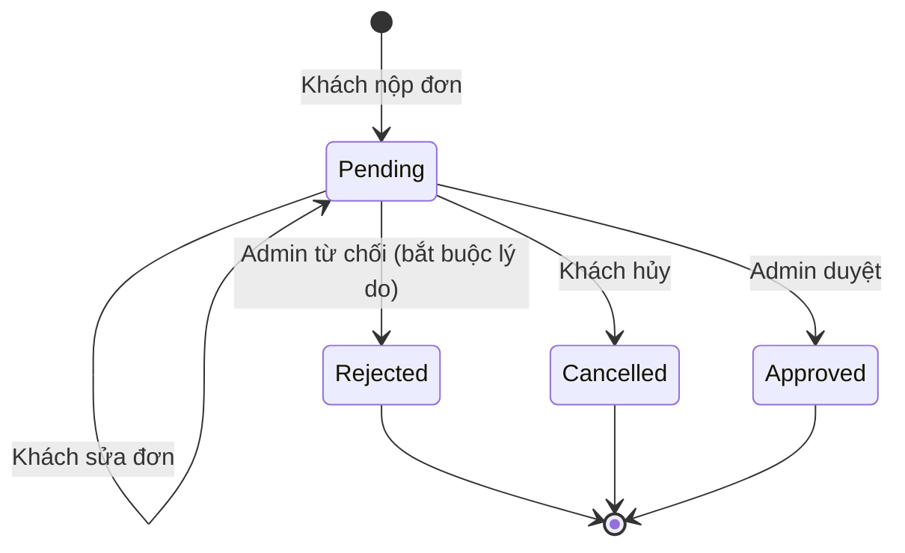
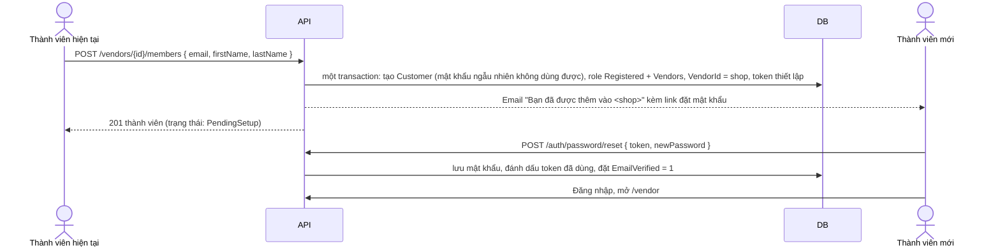

# Module Vendors (Người bán)

> Bản tiếng Việt của [vendors.md](vendors.md). Khi sửa một bản, cập nhật cả bản còn lại.
> Yêu cầu: [vendors-prd.md](vendors-prd.md). Đặc tả API đầy đủ: [vendors-api.md](vendors-api.md).

## Trạng thái

**Phần quản lý vendor đã có code. Phần vendor tự đăng ký và phần tài khoản thành viên của shop mới được thiết kế, chưa có code.**

| Phần | Backend | Angular | Ghi chú |
|---|---|---|---|
| Entity vendor, admin CRUD, ghi chú | Xong | Xong (`/admin/vendors`) | Migration `202609250002`. Chức năng admin **tạo** vendor bị bỏ trong module này (quyết định D) |
| Admin liên kết tài khoản đã có với vendor | Xong | Xong | **Bị bỏ** trong module này (quyết định 9) |
| Danh sách và chi tiết vendor công khai | Xong | Xong (`/storefront/vendors`) | Chỉ vendor đang hoạt động, chưa bị xóa |
| Vendor portal: xem thông tin vendor của mình | Xong (`GET /vendor/portal`) | Chưa làm | `vendor.portal` chưa gắn với role nào |
| **Đơn đăng ký vendor (tự đăng ký)** | Đã thiết kế | Đã thiết kế | Phần 2 |
| **Thành viên vendor (tài khoản của shop)** | Đã thiết kế | Đã thiết kế | Phần 3 |

Để sau, ngoài phạm vi module này: vendor tự quản lý sản phẩm, đơn hàng và đối soát của vendor, ảnh và địa chỉ vendor, upload giấy tờ, cấu hình hoa hồng, phân quyền khác nhau giữa các thành viên.

## Phạm vi

Bao gồm:

- **Vendor chỉ được tạo ra khi admin duyệt đơn đăng ký.** Admin không tạo vendor trực tiếp được.
- Admin sửa, xóa mềm và xem danh sách vendor, thêm ghi chú nội bộ, xem và gỡ thành viên.
- Storefront hiển thị danh sách vendor đang hoạt động và trang chi tiết vendor.
- Tài khoản vendor đã đăng nhập xem được thông tin vendor của chính mình.
- Khách đã xác thực email nộp đơn xin làm vendor, admin duyệt hoặc từ chối. Khi duyệt, hệ thống tạo vendor, liên kết tài khoản và cấp role `Vendors` trong cùng một transaction.
- **Một vendor có thể có nhiều tài khoản ("thành viên"), và mọi thành viên có quyền như nhau. Bất kỳ thành viên nào cũng tạo được tài khoản mới cho shop và gỡ được thành viên khác.**
- **Mỗi tài khoản chỉ thuộc tối đa một vendor.**

Để sau:

- Role bên trong vendor như chủ shop, quản lý, nhân viên. Hiện mọi thành viên ngang quyền.
- Một tài khoản thuộc nhiều vendor.
- Liên kết hoặc mời một tài khoản khách đã có vào shop. Không có kế hoạch làm: tài khoản của shop luôn được tạo mới (quyết định 9).
- Upload giấy tờ cá nhân hoặc giấy phép kinh doanh (hiện chưa có chức năng lưu file).
- Vendor tự sửa thông tin shop trong portal.
- Email báo cho admin khi có đơn mới.

## Tham chiếu từ nopCommerce

- `Nop.Core.Domain.Vendors.Vendor` và `VendorNote`: cấu trúc entity (`PictureId`, `AddressId`, `AdminComment`, `Deleted`, `DisplayOrder`).
- `Customer.VendorId`: liên kết tài khoản với vendor. Giống nopCommerce, nhiều tài khoản có thể trỏ tới cùng một vendor và đều có quyền vendor như nhau.
- `VendorController.ApplyVendor` (chức năng "Apply for vendor account" của nopCommerce): ý tưởng tự đăng ký. nopCommerce tạo ngay một vendor chưa kích hoạt khi khách nộp đơn. Nomori thì lưu đơn vào bảng riêng `VendorApplication`, nhờ vậy đơn bị từ chối hoặc bị hủy không sinh ra bản ghi vendor, và lịch sử duyệt được giữ lại.
- nopCommerce không có chức năng vendor tự quản lý thành viên. Phần 3 là thiết kế riêng của Nomori.

## Nguyên tắc cốt lõi

**Tài khoản có role `Vendors` khi và chỉ khi `Customer.VendorId` có giá trị.**

Mọi thao tác liên kết hoặc gỡ liên kết tài khoản đều cập nhật `Customer.VendorId` và role `Vendors` trong cùng một transaction:

| Thao tác | `Customer.VendorId` | Role `Vendors` |
|---|---|---|
| Đơn đăng ký được duyệt | đặt giá trị | thêm |
| Thành viên tạo tài khoản mới | đặt giá trị | thêm |
| Thành viên hoặc admin gỡ một thành viên | xóa giá trị | gỡ |
| Vendor bị xóa mềm | xóa giá trị cho mọi thành viên | gỡ khỏi mọi thành viên |

Role được cộng dồn. Thành viên vendor vẫn giữ role `Registered` và vẫn mua hàng được như khách bình thường.

---

## Phần 1: Quản lý vendor (đã có code)

### Data model

Migration `202609250002 VendorMigration`:

- `Vendor`: `Id`, `Name` (400), `Email` (320), `Description`, `PictureId`, `AddressId`, `AdminComment`, `Active`, `Deleted`, `DisplayOrder`, `CreatedOnUtc`, `UpdatedOnUtc`. Index `IX_Vendor_Active_Deleted`.
- `VendorNote`: `Id`, `VendorId` (FK, xóa theo vendor), `Note`, `CreatedOnUtc`.
- `Customer.VendorId`: FK có thể null tới `Vendor`, `ON DELETE SET NULL`, index không unique `IX_Customer_VendorId`. Nhiều tài khoản có thể trỏ tới một vendor; một tài khoản trỏ tới tối đa một vendor.
- `Product.VendorId`: đổi từ giá trị giữ chỗ `0` sang FK có thể null tới `Vendor`.
- Permission `vendor.manage` (đã cấp cho `Administrator`) và `vendor.portal` (chưa cấp cho role nào).

### Quy tắc nghiệp vụ

- Name bắt buộc, tối đa 400 ký tự. Email bắt buộc, tối đa 320 ký tự, được lưu sau khi bỏ khoảng trắng thừa và chuyển thành chữ thường.
- Xóa là xóa mềm (`Deleted = 1`). Vendor đã xóa không xuất hiện trong bất kỳ truy vấn nào.
- Storefront chỉ trả về vendor có `Active = 1`.

### API

Công khai (không cần đăng nhập):

```text
GET /api/v1/vendors?page=&pageSize=&search=
GET /api/v1/vendors/{id}
```

Vendor portal (`vendor.portal`):

```text
GET /api/v1/vendor/portal
```

Admin (`vendor.manage`):

```text
GET    /api/v1/admin/vendors?page=&pageSize=&search=&active=
GET    /api/v1/admin/vendors/{id}
POST   /api/v1/admin/vendors                         bị bỏ trong module này (quyết định D)
PUT    /api/v1/admin/vendors/{id}
DELETE /api/v1/admin/vendors/{id}
POST   /api/v1/admin/vendors/{id}/customer          { "customerId": 12 }   bị bỏ trong module này
DELETE /api/v1/admin/vendors/{id}/customer/{customerId}      bị bỏ trong module này
GET    /api/v1/admin/vendors/{id}/notes
POST   /api/v1/admin/vendors/{id}/notes              { "note": "..." }
DELETE /api/v1/admin/vendors/{id}/notes/{noteId}
```

Sau module này, các route public, portal và admin ở trên được gộp thành một bộ route dưới `/api/v1/vendors`. Xem bảng chuyển đổi route cũ sang route mới trong [vendors-api.md](vendors-api.md), mục 2.

### Vị trí code

```text
src/Nomori.Marketplace.Core/Vendors/Vendor.cs                 entity, command, IVendorStore, IVendorService
src/Nomori.Marketplace.Data/Vendors/SqlVendorStore.cs         store viết bằng ADO.NET
src/Nomori.Marketplace.Services/Vendors/VendorService.cs      validate và điều phối
src/Nomori.Marketplace.Api/Modules/Vendors/VendorController.cs  controller public, portal, admin và DTO

frontend: src/app/core/vendors/*, src/app/admin/pages/admin-vendors.page.ts,
          src/app/storefront/pages/vendor-list.page.ts, vendor-detail.page.ts
```

### Lỗi đã biết

Cả 4 lỗi đều vi phạm nguyên tắc cốt lõi. Module này sửa hết.

1. `vendor.portal` chưa gắn với role nào, nên không tài khoản nào vào được portal. **Cách sửa:** seed role `Vendors` có `vendor.portal`.
2. `AssignCustomerAsync` chỉ đặt `Customer.VendorId` mà không cấp role. Nó còn âm thầm chuyển một tài khoản đang thuộc vendor khác sang vendor mới. **Cách sửa:** bỏ endpoint này, bỏ `AssignCustomerAsync` và bỏ giao diện liên kết ở Angular. Liên kết tài khoản đã có không còn là một chức năng (quyết định 9).
3. `DELETE /admin/vendors/{id}/customer/{customerId}` bỏ qua `{id}`: tài khoản bị gỡ khỏi vendor mà nó đang thuộc, dù đó là vendor nào. Role cũng không bị thu hồi. **Cách sửa:** thay bằng `DELETE /vendors/{id}/members/{customerId}` (Phần 3). API mới kiểm tra `{id}` và gỡ `Vendors`.
4. Khi xóa mềm một vendor, `Customer.VendorId` vẫn trỏ tới vendor đó. **Cách sửa:** trong cùng transaction, xóa `VendorId` và gỡ `Vendors` của mọi thành viên.

---

## Phần 2: Đăng ký vendor (đã thiết kế)

### Luồng xử lý



Sau khi đơn ở trạng thái `Rejected` hoặc `Cancelled`, khách có thể nộp đơn mới. Các đơn `Approved`, `Rejected` và `Cancelled` không bao giờ bị sửa nữa, vì chúng là lịch sử duyệt.

Khi **duyệt**, hệ thống làm 4 bước trong cùng một transaction:

1. Tạo `Vendor` từ thông tin trong đơn (`Active = 1`).
2. Đặt `Customer.VendorId` bằng vendor vừa tạo.
3. Thêm role `Vendors` cho tài khoản nếu chưa có. Chỉ thêm, không thay các role đang có.
4. Chuyển đơn sang `Approved`, ghi `VendorId`, `ReviewedByCustomerId` và `ReviewedOnUtc`.

Sau khi commit, service gửi email báo duyệt và ghi audit event. Nếu gửi email lỗi thì chỉ ghi log, việc duyệt vẫn giữ nguyên.

Người được duyệt là thành viên đầu tiên của shop. Các tài khoản sau được thêm theo Phần 3, không cần nộp đơn.

Permission được đọc từ database ở mỗi request (`PermissionService`). Vì vậy người nộp đơn có quyền `vendor.portal` ngay sau khi được duyệt, không cần đăng nhập lại. Phía Angular chỉ cần tải lại danh sách permission.

### Quy tắc nghiệp vụ

Khi nộp đơn:

- Người gọi phải đăng nhập và có `EmailVerified = true`.
- Người gọi chưa được liên kết với vendor nào (`Customer.VendorId IS NULL`).
- Mỗi người chỉ có tối đa một đơn `Pending`. Quy tắc này được đảm bảo bằng một filtered unique index, nên nếu hai lần gửi đến cùng lúc thì chỉ một lần thành công.
- `ShopName` bắt buộc, tối đa 400 ký tự. Tên này không được trùng (không phân biệt hoa thường) với vendor chưa bị xóa hoặc với đơn `Pending` khác.
- `Email` bắt buộc, tối đa 320 ký tự, được lưu sau khi bỏ khoảng trắng thừa và chuyển thành chữ thường. `PhoneNumber` bắt buộc, tối đa 50 ký tự, dùng cùng quy tắc ký tự với số điện thoại trong hồ sơ khách.
- `Description` không bắt buộc. `TaxCode` không bắt buộc, tối đa 50 ký tự. `BusinessAddress` không bắt buộc, tối đa 1000 ký tự.

Khi duyệt đơn:

- Chỉ đơn `Pending` mới được sửa, hủy, duyệt hoặc từ chối. Các trạng thái khác trả `409`.
- Nếu từ lúc nộp đơn đến lúc duyệt, tài khoản đã được liên kết với một vendor, việc duyệt trả `409`.
- Khi duyệt, admin có thể sửa lại `ShopName` và thêm `AdminComment`.
- Từ chối phải có `Reason`, tối đa 2000 ký tự. Lý do này hiển thị cho người nộp đơn và có trong email.

### Data model

Migration `202609260001 VendorApplicationMigration`:

| Cột | Kiểu | Ghi chú |
|---|---|---|
| `Id` | `int` identity PK | |
| `CustomerId` | `int` FK → `Customer` | người nộp đơn |
| `ShopName` | `nvarchar(400)` | cùng độ dài với `Vendor.Name` |
| `Email` | `nvarchar(320)` | email liên hệ của shop |
| `PhoneNumber` | `nvarchar(50)` | |
| `Description` | `nvarchar(max)` null | |
| `TaxCode` | `nvarchar(50)` null | mã số thuế |
| `BusinessAddress` | `nvarchar(1000)` null | địa chỉ kinh doanh |
| `Status` | `int` | `0` Pending, `1` Approved, `2` Rejected, `3` Cancelled |
| `RejectReason` | `nvarchar(2000)` null | lý do từ chối |
| `ReviewedByCustomerId` | `int` null FK → `Customer` | admin đã duyệt |
| `ReviewedOnUtc` | `datetime2` null | thời điểm duyệt |
| `VendorId` | `int` null FK → `Vendor` | điền khi được duyệt |
| `CreatedOnUtc`, `UpdatedOnUtc` | `datetime2` | |

Index:

- `UX_VendorApplication_Customer_Pending`: unique theo `CustomerId`, lọc `WHERE Status = 0`.
- `IX_VendorApplication_Status_CreatedOnUtc`: phục vụ trang danh sách đơn của admin.

Dữ liệu seed (dùng `IF NOT EXISTS` để chạy lại không lỗi, giống `VendorMigration`):

- Role `Vendors` (`IsSystemRole = 1`, `Active = 1`).
- Gắn `vendor.portal` cho `Vendors`.
- Bổ sung dữ liệu cũ cho khớp nguyên tắc cốt lõi: xóa `VendorId` của các tài khoản đang trỏ tới vendor đã bị xóa, sau đó cấp `Vendors` cho mọi tài khoản có `VendorId` khác null.

`Down()` xóa các dòng gắn role, xóa role và xóa bảng.

### API

Đặc tả đầy đủ: [vendors-api.md](vendors-api.md), mục 3. Khách và admin dùng chung một bộ route; mỗi request xác định người gọi được làm gì.

| Method | Route | Ai được gọi |
|---|---|---|
| `POST` | `/api/v1/vendor-applications` | Khách hàng |
| `GET` | `/api/v1/vendor-applications` | Khách hàng (đơn của mình), admin (tất cả, lọc được theo `status` và `search`) |
| `GET` | `/api/v1/vendor-applications/{id}` | Người nộp đơn, admin |
| `PUT` | `/api/v1/vendor-applications/{id}` | Người nộp đơn, khi đơn còn `pending` |
| `PUT` | `/api/v1/vendor-applications/{id}/status` | Admin: `approved` hoặc `rejected` (bắt buộc lý do). Người nộp đơn: `cancelled` |

---

## Phần 3: Thành viên vendor (đã thiết kế)

### Luồng xử lý



- Tài khoản mới không bao giờ nhận mật khẩu từ người khác. Người tạo không nhìn thấy và không đặt mật khẩu cho tài khoản đó.
- Link thiết lập dùng lại bảng `PasswordRecoveryToken` và trang `/auth/reset-password` đang có, nhưng thời hạn dài hơn.
- Người nhận đã dùng link trong email, tức là chứng minh được họ sở hữu hộp thư đó. Vì vậy khi đặt mật khẩu thành công, hệ thống cũng đặt `EmailVerified = 1`. Thay đổi này áp dụng cho mọi lần đặt lại mật khẩu, không riêng việc thiết lập tài khoản vendor.

### Quy tắc nghiệp vụ

Khi tạo thành viên:

- Người gọi phải có `vendor.portal` và thuộc một vendor đang hoạt động, chưa bị xóa. Vendor ID luôn lấy từ `Customer.VendorId` của chính người gọi, không bao giờ nhận từ request.
- `Email` bắt buộc, đúng định dạng, tối đa 320 ký tự, được lưu sau khi bỏ khoảng trắng thừa và chuyển thành chữ thường.
- **Email không được trùng với bất kỳ tài khoản nào đã có, kể cả tài khoản đã bị xóa → `409`.** Tài khoản của shop luôn được tạo mới, nhờ vậy chắc chắn tài khoản đó không thuộc vendor nào khác. Không có cách nào đưa một tài khoản đã có vào shop; người đó phải dùng một email khác (quyết định 9).
- `FirstName` và `LastName` không bắt buộc, mỗi field tối đa 100 ký tự (cùng quy tắc với hồ sơ khách).
- Mỗi vendor có tối đa `Vendor:MaxMembersPerVendor` thành viên (mặc định `20`). Khi đã đủ thì trả `409`.
- Tài khoản mới có `Active = 1`, `EmailVerified = 0`, role `Registered` và `Vendors`, và một mật khẩu ngẫu nhiên 32 byte được hash, không ai được xem. Tài khoản chưa đăng nhập được cho tới khi người nhận tự đặt mật khẩu.

Link thiết lập:

- Thời hạn `Authentication:VendorMemberSetupTokenLifetimeHours` (mặc định `72` giờ), chỉ dùng được một lần.
- Khi thành viên mới còn ở trạng thái `PendingSetup`, bất kỳ thành viên nào cũng gửi lại được email thiết lập. Gửi lại sẽ làm vô hiệu các token thiết lập cũ của tài khoản đó.

Khi gỡ thành viên:

- Vì mọi thành viên ngang quyền, bất kỳ thành viên nào cũng gỡ được thành viên khác trong cùng shop, kể cả người đã tạo ra mình.
- Thành viên có thể tự gỡ chính mình ("rời shop").
- **Không được gỡ thành viên cuối cùng, và thành viên cuối cùng cũng không được rời shop → `409`.** Chỉ admin mới làm shop hết thành viên được, bằng cách xóa vendor.
- Việc gỡ làm 3 việc trong một transaction: xóa `VendorId`, gỡ role `Vendors`, và đặt `RequireReLogin = 1` để đăng xuất tài khoản đó khỏi các phiên đang mở. Tài khoản vẫn còn, trở thành tài khoản khách bình thường.

Trạng thái thành viên (tính ra khi đọc, không lưu vào DB):

| Trạng thái | Điều kiện |
|---|---|
| `PendingSetup` | tài khoản chưa từng tự đặt mật khẩu (chưa đặt lại mật khẩu thành công, chưa đăng nhập lần nào) |
| `Active` | tài khoản đã đăng nhập ít nhất một lần (`LastLoginDateUtc` có giá trị) |

### Data model

Không cần bảng mới. Thiết kế dùng `Customer.VendorId`, `CustomerCustomerRoleMapping` và `PasswordRecoveryToken`, đều đã có sẵn.

Cấu hình mới:

| Key | Mặc định | Nằm trong |
|---|---|---|
| `MaxMembersPerVendor` | `20` | section mới `Vendor` |
| `VendorMemberSetupTokenLifetimeHours` | `72` | `Authentication` (`SecurityOptions`) |
| `VendorMemberSetupSubject` | "You have been added to a shop on Nomori Marketplace" | `Email` (`EmailOptions`) |

### API

Đặc tả đầy đủ: [vendors-api.md](vendors-api.md), mục 5. Thành viên và admin dùng chung một bộ route. Người gọi không phải admin và không phải thành viên của `{id}` thì nhận `404`.

| Method | Route | Ai được gọi |
|---|---|---|
| `GET` | `/api/v1/vendors/{id}/members` | Thành viên của `{id}`, admin |
| `POST` | `/api/v1/vendors/{id}/members` | Chỉ thành viên của `{id}` (admin nhận `403`) |
| `POST` | `/api/v1/vendors/{id}/members/{customerId}/setup-email` | Chỉ thành viên của `{id}` (admin nhận `403`) |
| `DELETE` | `/api/v1/vendors/{id}/members/{customerId}` | Thành viên của `{id}`, admin. Không gỡ được thành viên cuối cùng (`409`) |

Vendor portal biết shop của mình qua `vendorId` trong `GET /api/v1/auth/session`, rồi đọc thông tin shop bằng `GET /api/v1/vendors/{id}`.

---

## Các mục dùng chung

### Audit event

| Event | Chi tiết (không lưu dữ liệu cá nhân) |
|---|---|
| `vendor.application_submitted` | `applicationId` |
| `vendor.application_updated` | `applicationId`, tên các field đã đổi |
| `vendor.application_cancelled` | `applicationId` |
| `vendor.application_approved` | `applicationId`, `vendorId`, người duyệt |
| `vendor.application_rejected` | `applicationId`, người duyệt |
| `vendor.member_created` | `vendorId`, `customerId` mới, người thực hiện |
| `vendor.member_setup_resent` | `vendorId`, `customerId`, người thực hiện |
| `vendor.member_removed` | `vendorId`, `customerId`, người thực hiện, `self: true/false`, `byAdmin: true/false` |

### Email

Thêm key mới vào `EmailOptions` và các file `appsettings*.json`:

- `VendorApplicationApprovedSubject`: email có link tới `{FrontendBaseUrl}/vendor`.
- `VendorApplicationRejectedSubject`: email có lý do từ chối (đã HTML-encode) và link tới `{FrontendBaseUrl}/customer/become-vendor`.
- `VendorMemberSetupSubject`: email có tên shop (đã HTML-encode) và link tới `{FrontendBaseUrl}/auth/reset-password?token=...&setup=1`.

Email chỉ được gửi khi `Email.Enabled` là `true`, giống cách `EmailVerificationService` đang làm. Khi API chạy ở môi trường Development và tắt email, response của API tạo thành viên và API gửi lại email có thêm `developmentSetupToken`, giống API đăng ký tài khoản, để vẫn test được luồng này.

### Vị trí code

Tạo mới:

```text
Core      src/Nomori.Marketplace.Core/Vendors/VendorApplication.cs
            VendorApplication, VendorApplicationStatus, command Submit/Update/Approve/Reject,
            VendorApplicationQuery, IVendorApplicationStore, IVendorApplicationService
          src/Nomori.Marketplace.Core/Vendors/VendorMember.cs
            read model VendorMember, VendorMemberStatus, CreateVendorMemberCommand,
            IVendorMemberStore, IVendorMemberService, VendorOptions
Data      src/Nomori.Marketplace.Data/Migrations/Vendors/VendorApplicationMigration.cs
          src/Nomori.Marketplace.Data/Vendors/SqlVendorApplicationStore.cs
            ApproveAsync chạy 4 bước duyệt trong một SqlTransaction;
            SqlException 2601/2627 khi insert được hiểu là "đã có đơn Pending"
          src/Nomori.Marketplace.Data/Vendors/SqlVendorMemberStore.cs
            CreateMemberAsync (customer + mật khẩu + role + VendorId + token thiết lập, một transaction),
            RemoveMemberAsync (xóa VendorId + gỡ role + RequireReLogin, một transaction),
            ListMembersAsync, CountMembersAsync
Services  src/Nomori.Marketplace.Services/Vendors/VendorApplicationService.cs
          src/Nomori.Marketplace.Services/Vendors/VendorMemberService.cs
Api       src/Nomori.Marketplace.Api/Modules/Vendors/VendorApplicationController.cs
          src/Nomori.Marketplace.Api/Modules/Vendors/VendorMemberController.cs
          src/Nomori.Marketplace.Api/Modules/Vendors/VendorNoteController.cs
Web       src/Nomori.Marketplace.Web.Framework/Vendors/IVendorAccessContext.cs
            thông tin người gọi, tính một lần cho mỗi request: IsAdmin, CustomerId, MemberVendorId
```

Sửa:

```text
src/Nomori.Marketplace.Core/Email/EmailOptions.cs           thêm 3 key tiêu đề email
src/Nomori.Marketplace.Core/Security/SecurityOptions.cs      thêm VendorMemberSetupTokenLifetimeHours
src/Nomori.Marketplace.Api/appsettings*.json                key mới + section Vendor
src/Nomori.Marketplace.Api/Program.cs                        đăng ký DI, bind VendorOptions
src/Nomori.Marketplace.Core/Vendors/Vendor.cs                 bỏ AssignCustomerAsync / UnassignCustomerAsync / SetCustomerVendorAsync
src/Nomori.Marketplace.Data/Vendors/SqlVendorStore.cs        lỗi 4: xóa vendor thì gỡ mọi thành viên và thu hồi role
src/Nomori.Marketplace.Services/Vendors/VendorService.cs     bỏ assign/unassign
src/Nomori.Marketplace.Api/Modules/Vendors/VendorController.cs  một controller cho mọi người gọi: GET danh sách, GET chi tiết, PUT, DELETE;
                                                             bỏ VendorPortalController, AdminVendorController, các endpoint /customer,
                                                             POST /admin/vendors và các DTO public/admin riêng (thay bằng VendorResponse)
src/Nomori.Marketplace.Api/Modules/Authentication/AuthenticationController.cs  SessionResponse có thêm vendorId
src/Nomori.Marketplace.Data/Customers/SqlCustomerIdentityStore.cs
                                                             ResetPasswordWithRecoveryTokenAsync đặt thêm EmailVerified = 1
src/Nomori.Marketplace.Core/Vendors/Vendor.cs + VendorService.cs
                                                             bỏ CreateVendorCommand và CreateAsync (bước duyệt đơn tự insert vendor)
```

### Angular

Tạo mới:

```text
src/app/core/vendors/vendor-application.models.ts
src/app/core/vendors/vendor-application-api.service.ts
src/app/core/vendors/vendor-member-api.service.ts
src/app/customer/pages/become-vendor.page.ts          /customer/become-vendor    authGuard
src/app/admin/pages/admin-vendor-applications.page.ts /admin/vendor-applications permissionGuard(vendorManage)
src/app/vendor/vendor.routes.ts
src/app/vendor/pages/vendor-portal.page.ts            /vendor                    permissionGuard(vendorPortal)
src/app/vendor/pages/vendor-members.page.ts           /vendor/members            permissionGuard(vendorPortal)
```

Sửa: `app.routes.ts` (thêm lazy route `vendor`), `customer.routes.ts`, `admin.routes.ts`, menu ở header và trang admin home. `core/vendors/vendor-api.service.ts`: một bộ hàm dùng các route `/vendors` đã gộp, và một model `VendorResponse` duy nhất. `core/auth`: đọc `vendorId` từ session. `admin/pages/admin-vendors.page.ts`: bỏ giao diện liên kết tài khoản; bỏ nút **+ New vendor**, form tạo vendor và hàm `adminCreateVendor`; thêm khung **Thành viên** chỉ để xem, kèm nút **Gỡ**. Link chỉ hiện khi tài khoản có permission tương ứng. `auth/pages/reset-password.page.ts` hiển thị chữ "Đặt mật khẩu" khi URL có `setup=1`.

Các trạng thái của trang `become-vendor`:

| Trạng thái | Giao diện |
|---|---|
| Chưa xác thực email | Thông báo kèm link gửi lại email xác thực |
| Chưa có đơn | Form nộp đơn |
| Pending | Tóm tắt đơn (chỉ xem), nút **Sửa** và **Hủy** |
| Rejected | Lý do từ chối và nút **Nộp lại** (form điền sẵn dữ liệu cũ) |
| Cancelled | Form nộp đơn |
| Approved | Link tới vendor portal. Tải lại permission qua `AuthFacade` |

Trang duyệt đơn của admin gồm bảng lọc theo trạng thái và khung xem chi tiết. Nút Duyệt mở hộp xác nhận ngay trong trang, có các field tùy chọn để sửa tên shop và thêm ghi chú. Nút Từ chối chỉ bấm được khi đã nhập lý do.

Trang `vendor-members`:

- Bảng thành viên có nhãn trạng thái (`PendingSetup`, `Active`). Dòng của người đang đăng nhập được đánh dấu "Bạn".
- Form **Thêm tài khoản** (email, tên, họ). Tạo thành công thì hiện "Đã gửi email đặt mật khẩu tới …".
- Nút **Gửi lại email** ở các dòng `PendingSetup`.
- Nút **Gỡ** ở mọi dòng, trừ khi shop chỉ còn một thành viên. Có hộp xác nhận ngay trong trang. Khi thành viên tự gỡ chính mình, app tải lại permission và chuyển về `/storefront`.

### Test

- `tests/Nomori.Marketplace.Services.Tests/VendorApplicationServiceTests.cs` kiểm tra các trường hợp:
  - chưa xác thực email thì bị chặn;
  - tài khoản đã liên kết vendor thì bị chặn;
  - nộp đơn Pending thứ hai thì bị chặn;
  - trùng tên shop thì bị chặn;
  - sửa, hủy, duyệt và từ chối chỉ hoạt động khi đơn còn Pending;
  - từ chối phải có lý do;
  - email chỉ được gửi khi đã bật;
  - gửi email lỗi không làm hỏng việc duyệt;
  - mỗi thao tác ghi đúng audit event.
- `tests/Nomori.Marketplace.Services.Tests/VendorMemberServiceTests.cs` kiểm tra các trường hợp:
  - email đã có tài khoản (kể cả tài khoản đã xóa) thì bị chặn;
  - shop đã đủ thành viên thì bị chặn;
  - người gọi không thuộc vendor nào, hoặc vendor đã bị xóa, thì bị chặn;
  - vendor ID lấy từ người gọi, không lấy từ request;
  - thành viên của shop khác trả "không tìm thấy" khi gửi lại email hoặc gỡ;
  - không gỡ được thành viên cuối cùng, và thành viên cuối cùng không rời shop được;
  - gỡ thành viên thì xóa `VendorId`, gỡ role và đặt `RequireReLogin`;
  - gửi lại email làm vô hiệu token thiết lập cũ;
  - mỗi thao tác ghi đúng audit event.
- `tests/Nomori.Marketplace.Services.Tests/VendorServiceTests.cs`: xóa vendor thì gỡ mọi thành viên và thu hồi role (lỗi 4).
- Endpoint thành viên khi admin gọi: gỡ một tài khoản không thuộc `{id}` thì trả `404`; gỡ thành viên cuối cùng thì trả `409`; tạo thành viên và gửi lại email thì trả `403`.
- `POST /api/v1/admin/vendors` không còn tồn tại.
- `tests/Nomori.Marketplace.Services.Tests/AuthenticationServiceTests.cs`: đặt lại mật khẩu thành công thì `EmailVerified` được bật.
- `tests/Nomori.Marketplace.Data.Tests/VendorApplicationMigrationTests.cs`: version migration và role được seed.
- `tests/Nomori.Marketplace.Api.Tests`:
  - `GET /vendors` và `GET /vendors/{id}` ẩn vendor đang tắt và các field riêng của admin với khách vãng lai và khách hàng, hiện đầy đủ với admin, và hiện vendor đang tắt kèm field của thành viên cho chính thành viên của vendor đó;
  - `GET /vendor-applications` chỉ trả đơn của chính mình khi khách hàng gọi;
  - `PUT /vendor-applications/{id}/status` trả `403` khi khách hàng duyệt hoặc từ chối, hoặc khi admin hủy đơn của người khác;
  - endpoint thành viên và ghi chú trả `404` hoặc `403` khi người gọi không có quyền;
  - các endpoint ghi dữ liệu trả `401` khi chưa đăng nhập.

### Hướng dẫn test thủ công

Đăng ký vendor:

1. Chạy `dotnet run --project src/Nomori.Marketplace.DbMigrator -- migrate` rồi khởi động lại API.
2. Mở SSMS, kiểm tra bảng `VendorApplication` đã có, role `Vendors` đã có và đã được gắn `vendor.portal`.
3. Khách A đăng ký nhưng chưa xác thực email. Mở `/customer/become-vendor`: phải không nộp được đơn.
4. Xác thực email rồi nộp đơn. Trạng thái hiển thị **Pending**. Gọi API nộp lần nữa phải trả `409`.
5. Đăng nhập admin, mở `/admin/vendor-applications`, từ chối đơn kèm lý do, rồi kiểm tra email báo từ chối.
6. Đăng nhập lại khách A: lý do từ chối được hiển thị. Bấm **Nộp lại** và gửi đơn.
7. Đăng nhập admin, duyệt đơn. Kiểm tra `/admin/vendors` có vendor mới và khách A đã có role `Vendors`.
8. Ở tài khoản khách A, không đăng xuất, mở `/vendor`: trang hiển thị thông tin shop. `GET /api/v1/auth/session` trả `vendorId` mới, và `GET /api/v1/vendors/{vendorId}` trả cả các field dành cho thành viên.

Thành viên vendor:

9. Ở tài khoản A, mở `/vendor/members` và thêm `b@example.com`. B hiện với trạng thái `PendingSetup` và nhận được email đặt mật khẩu.
10. Thử thêm email của chính A, hoặc bất kỳ email nào đã đăng ký → `409`.
11. Ở phía B, mở link, đặt mật khẩu, đăng nhập và mở `/vendor`: B thấy cùng shop với A. Trong SSMS, B có `EmailVerified = 1`, `VendorId` là shop đó, và có role `Registered` và `Vendors`.
12. B thêm tài khoản C. C hoàn tất đặt mật khẩu. Shop giờ có 3 thành viên ngang quyền.
13. C gỡ A. A bị đăng xuất, mở `/vendor` thì bị chặn, nhưng A vẫn đăng nhập được như khách bình thường.
14. B gỡ C, rồi thử rời shop: B là thành viên cuối cùng nên nhận `409`.
15. Đăng nhập admin, mở `/admin/vendors`: không còn nút **New vendor** và giao diện liên kết tài khoản. Mở shop của B: khung **Thành viên** hiện B. Không gỡ được B vì B là thành viên cuối cùng.
16. Đăng nhập admin và xóa vendor của B. B mất role `Vendors` và `VendorId` bị xóa.
17. Gọi `GET /api/v1/admin/authorization/audit-logs?take=100` và kiểm tra đủ các event `vendor.application_*` và `vendor.member_*`.

### Quyết định

Đã chốt:

| # | Quyết định |
|---|---|
| A | Một vendor có nhiều tài khoản, mọi thành viên có quyền như nhau |
| B | Bất kỳ thành viên nào cũng tạo được tài khoản mới cho shop |
| C | Mỗi tài khoản chỉ thuộc tối đa một vendor |
| 6 | Thành viên được gỡ nhau và tự rời shop, trừ thành viên cuối cùng |
| 7 | Tối đa 20 thành viên mỗi vendor, cấu hình được |
| 8 | Link đặt mật khẩu có hạn 72 giờ, gửi lại được |
| 9 | Email đã có tài khoản thì trả `409`. Bỏ chức năng liên kết tài khoản đã có với vendor |
| D | Vendor chỉ được tạo qua đơn đăng ký đã duyệt. Admin không tạo được vendor, cũng không tạo được tài khoản thành viên |
| 1 | Vendor hoạt động ngay (`Active = 1`) sau khi được duyệt |
| 2 | Chưa làm upload giấy tờ; làm sau khi có chức năng lưu file |
| 3 | Không gửi email báo admin khi có đơn mới; admin xem trên trang duyệt đơn |
| 4 | Bị từ chối thì được nộp lại ngay |
| 5 | Duyệt đơn dùng chung `vendor.manage`, permission này chỉ cấp cho `Administrator` |

### Triển khai

1. Chạy migrator trước khi khởi động API. Vendor và tài khoản khách đang có không bị ảnh hưởng.
2. Những tài khoản admin đã liên kết với vendor trước thay đổi này vẫn chưa có role `Vendors`. Migration sẽ tự cấp `Vendors` cho mọi tài khoản có `VendorId` khác null và vendor chưa bị xóa, để nguyên tắc cốt lõi đúng ngay từ đầu. Migration cũng xóa `VendorId` của các tài khoản đang trỏ tới vendor đã bị xóa.
3. Những vendor admin đã tạo trước thay đổi này mà chưa có thành viên vẫn được giữ nguyên, nhưng không ai quản lý được chúng từ portal. Hãy xem lại trong `/admin/vendors` và xóa những vendor không cần.
